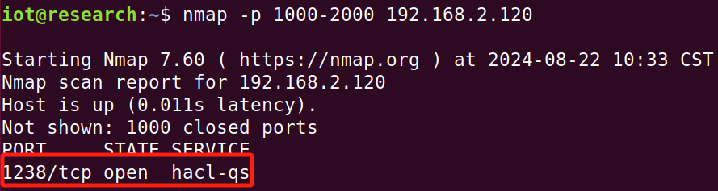
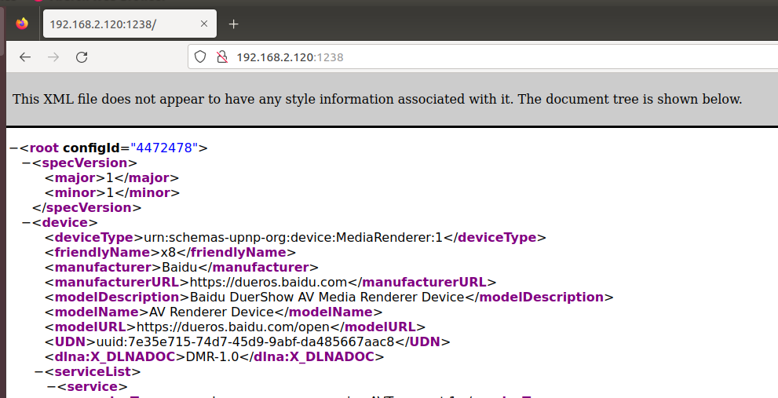
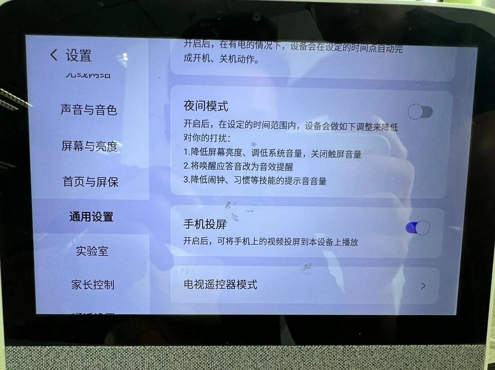
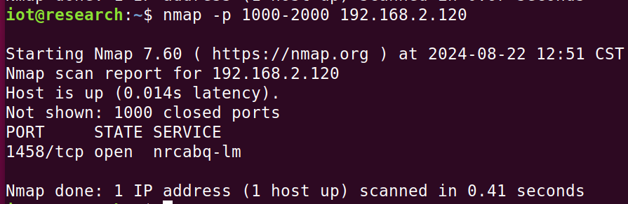
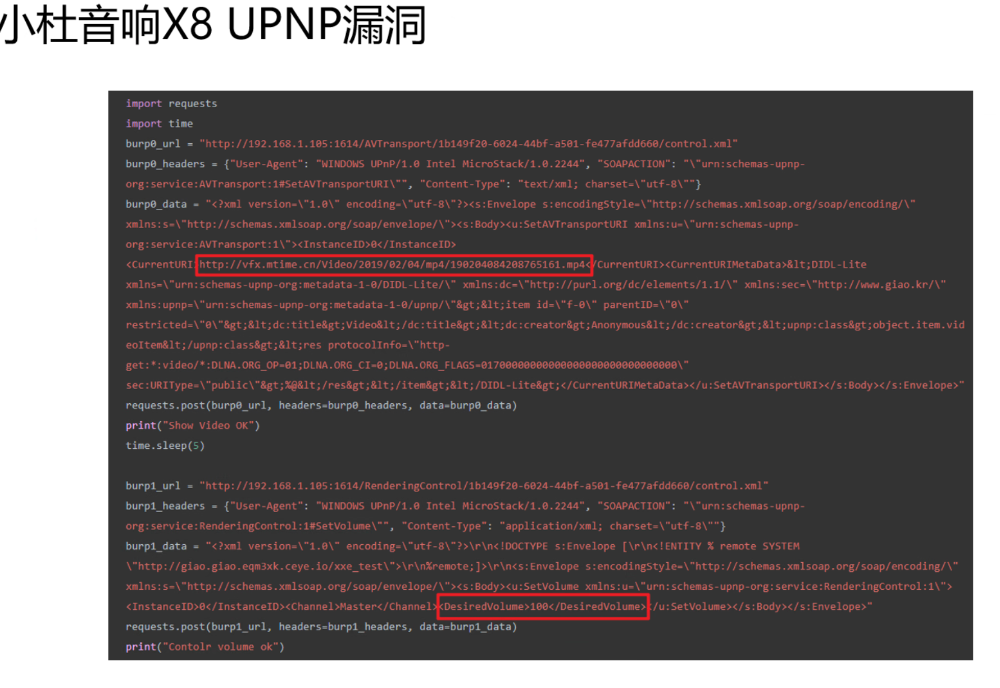

# 基础信息
让其与本机连至同一网段上面
通过nmap扫描其1000-2000端口发现开放了一个1238端口
```sh
nmap -p 1000-2000 192.168.2.120
```



通过访问192.168.2.120:1238发现是一个XML文件



恢复了一次出厂设置，切记要开启手机投屏功能才会开启upnp协议，才会有开放端口才能访问到xml文件



nmap再次扫描发现端口号已经变了，说明是随机的，大概范围应该在1000-2000之间



# XML文件分析
## 服务列表（serviceList）
服务列表包含设备可以提供的不同服务，每个服务都支持特定的功能。以下是三个主要服务的详细信息：
### 1. AVTransport 服务
- **serviceType**: `urn:schemas-upnp-org:service:AVTransport:1`
    - 这是定义音频/视频传输的服务类型。
- **serviceId**: `urn:upnp-org:serviceId:AVTransport`
    - 唯一标识该服务的 ID。
- **SCPDURL**:
    - `/AVTransport/7e35e715-74d7-45d9-9abf-da485667aac8/scpd.xml`
    - 这个 URL 指向该服务的描述文档，定义了可用的操作和状态变量。
- **controlURL**:
    - `/AVTransport/7e35e715-74d7-45d9-9abf-da485667aac8/control.xml`
    - 该 URL 用于接收控制命令，如播放、暂停、停止等。
- **eventSubURL**:
    - `/AVTransport/7e35e715-74d7-45d9-9abf-da485667aac8/event.xml`
    - 用于事件订阅，当服务状态变化时，设备可通过此 URL 通知订阅者。
### 2. ConnectionManager 服务
- **serviceType**: `urn:schemas-upnp-org:service:ConnectionManager:1`
    - 定义连接管理功能的服务类型。
- **serviceId**: `urn:upnp-org:serviceId:ConnectionManager`
    - 唯一标识该服务的 ID。
- **SCPDURL**:
    - `/ConnectionManager/7e35e715-74d7-45d9-9abf-da485667aac8/scpd.xml`
    - 指向描述该服务功能的文档。
- **controlURL**:
    - `/ConnectionManager/7e35e715-74d7-45d9-9abf-da485667aac8/control.xml`
    - 用于处理连接请求和管理连接状态。
- **eventSubURL**:
    - `/ConnectionManager/7e35e715-74d7-45d9-9abf-da485667aac8/event.xml`
    - 用于订阅连接状态的变化。
### 3. RenderingControl 服务
- **serviceType**: `urn:schemas-upnp-org:service:RenderingControl:1`
    - 定义渲染控制功能的服务类型。
- **serviceId**: `urn:upnp-org:serviceId:RenderingControl`
    - 唯一标识该服务的 ID。
- **SCPDURL**:
    - `/RenderingControl/7e35e715-74d7-45d9-9abf-da485667aac8/scpd.xml`
    - 指向描述该服务功能和支持操作的文档。
- **controlURL**:
    - `/RenderingControl/7e35e715-74d7-45d9-9abf-da485667aac8/control.xml`
    - 用于接收控制命令，如音量调节、音频/视频效果设置等。
- **eventSubURL**:
    - `/RenderingControl/7e35e715-74d7-45d9-9abf-da485667aac8/event.xml`
    - 用于事件订阅，通知用户关于渲染状态的变化。


# Tips:


