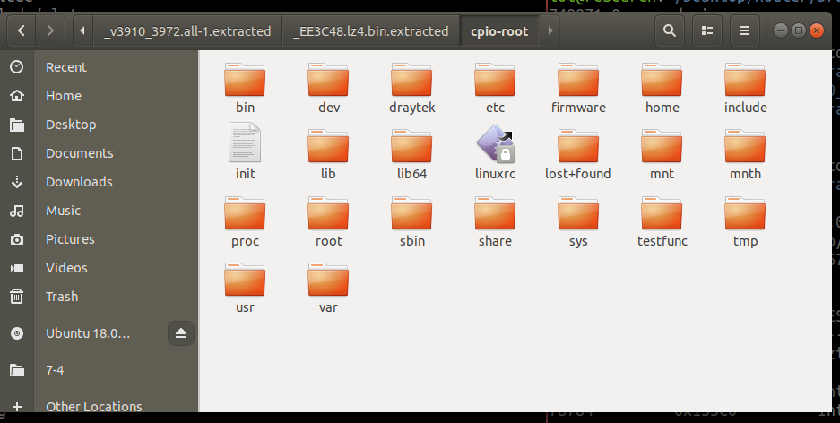
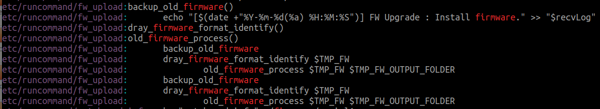

# CVE-2024-41592
## 漏洞描述：
DrayTek Vigor3910 devices through 4.3.2.6 have a stack-based overflow when processing query string parameters because GetCGI mishandles extraneous ampersand characters and long key-value pairs.  
DrayTek Vigor3910 设备在 4.3.2.6 及之前版本在处理查询字符串参数时出现基于堆栈的溢出，因为 GetCGI 错误地处理了无关的 & 字符和长键值对。

## 固件下载地址：
[Index of /Vigor3910/Firmware](https://fw.draytek.com.tw/Vigor3910/Firmware/)

## 固件解密：
通过binwalk -E查看可以发现其镝值为1，可以得知此固件为加密固件


那么我们去查找一下以前版本有没有中间过渡件

在固件下载链接下载到V3.9.7.1版本，binwalk -Me可以解出特征，但并不支持binwalk解压，解压不出来完整的文件系统


但通过-E参数可以知道，此固件并没有加密


联系一下固件的基本结构，bootloader引导加载程序，kernel内核（通常采用压缩的方式），rootfs文件系统......

那么根据binwalk的解析出来的信息可以分析得知

此块推测可能为bootloader  0-0x2C0A57
```
273054        0x42A9E         Unix path: /home/eason_jhan/1000b/cavium/firmware/bdk/libbdk-os/bdk-rlock.c
280056        0x445F8         AES S-Box
280568        0x447F8         AES Inverse S-Box
283704        0x45438         SHA256 hash constants, little endian
469662        0x72A9E         Unix path: /home/eason_jhan/1000b/cavium/firmware/bdk/libbdk-os/bdk-rlock.c
476664        0x745F8         AES S-Box
477176        0x747F8         AES Inverse S-Box
480312        0x75438         SHA256 hash constants, little endian
571444        0x8B834         AES Inverse S-Box
571700        0x8B934         AES S-Box
573012        0x8BE54         SHA256 hash constants, little endian
833588        0xCB834         AES Inverse S-Box
833844        0xCB934         AES S-Box
835156        0xCBE54         SHA256 hash constants, little endian
2032941       0x1F052D        Neighborly text, "neighbor %d too different %d from average %d, picking %d.LMC%d.R%d: MAJORTY: Byte %d: picking majority of %d over average %d."
2057224       0x1F6408        AES S-Box
2057736       0x1F6608        AES Inverse S-Box
2079947       0x1FBCCB        Unix path: /home/eason_jhan/1000b/cavium/firmware/bdk/libbdk-os/bdk-rlock.c
2096368       0x1FFCF0        SHA256 hash constants, little endian
2119768       0x205858        LZMA compressed data, properties: 0x5D, dictionary size: 65536 bytes, uncompressed size: 2285442 bytes
```

此块可能为kernel  0x205858-0xEE3DF1，因为有LZMA压缩标识，并且这区间有ftb设备树标识
```
2886232       0x2C0A58        LZMA compressed data, properties: 0x5D, dictionary size: 65536 bytes, uncompressed size: 311880 bytes
3000920       0x2DCA58        LZMA compressed data, properties: 0x5D, dictionary size: 65536 bytes, uncompressed size: 630943 bytes
3155032       0x302458        Flattened device tree, size: 5542 bytes, version: 17
3160664       0x303A58        Flattened device tree, size: 4223 bytes, version: 17
3165272       0x304C58        Flattened device tree, size: 157 bytes, version: 17
3165784       0x304E58        Flattened device tree, size: 6321 bytes, version: 17
3172440       0x306858        Flattened device tree, size: 7806 bytes, version: 17
3180632       0x308858        Flattened device tree, size: 4081 bytes, version: 17
3184728       0x309858        Flattened device tree, size: 555 bytes, version: 17

省略......

3557526       0x364896        Copyright string: "Copyright (C) 2016, Cavium Inc."
3559079       0x364EA7        Copyright string: "copyright notice and this permission notice shall be"
3561562       0x36585A        Unix path: /sys/class/gpio/gpio472) for DSL model
5052256       0x4D1760        CRC32 polynomial table, little endian
5058320       0x4D2F10        AES Inverse S-Box
5065888       0x4D4CA0        AES S-Box
5099137       0x4DCE81        Motorola S-Record; binary data in text format, record type: header
5259312       0x504030        Linux kernel ARM64 image, load offset: 0x80000, image size: 44011520 bytes, little endian, 4k page size,
5499456       0x53EA40        SHA256 hash constants, little endian
12693552      0xC1B030        ELF, 64-bit LSB shared object, version 1 (SYSV)
12741544      0xC26BA8        gzip compressed data, maximum compression, from Unix, last modified: 1970-01-01 00:00:00 (null date)
12820184      0xC39ED8        Intel x86 or x64 microcode, sig 0xffffff80, pf_mask 0x00, 1DE0-08-26, size 2048
12820328      0xC39F68        Intel x86 or x64 microcode, sig 0xffffff80, pf_mask 0x00, 1DE0-08-26, size 2048
12897440      0xC4CCA0        DES SP2, little endian
12897952      0xC4CEA0        DES SP1, little endian
12923200      0xC53140        LZO compressed data
12925744      0xC53B30        CRC32 polynomial table, little endian
13188944      0xC93F50        Copyright string: "Copyright (c) 1999-2006 Intel Corporation."
13196536      0xC95CF8        Copyright string: "Copyright (c) 2009 - 2012 Intel Corporation."
13197320      0xC96008        Copyright string: "Copyright (c) 1999-2008 Intel Corporation."
13199736      0xC96978        Copyright string: "Copyright (c) 2013 - 2016 Intel Corporation."
13410380      0xCCA04C        Certificate in DER format (x509 v3), header length: 4, sequence length: 14848
14404968      0xDBCD68        Unix path: /dev/vc/0
14479296      0xDCEFC0        Ubiquiti partition header, header size: 56 bytes, name: "PARTNAME=%s", base address: 0x74790A00, data size: 23295090 bytes
14486472      0xDD0BC8        xz compressed data
14569424      0xDE4FD0        Unix path: /lib/firmware/updates/4.9.0-OCTEONTX_SDK_6_2_0_p3_build_38
14663912      0xDFC0E8        Ubiquiti firmware additional data, name: UTE DEVICE DIAGNOSTIC, size: 1145372672 bytes, size2: 0 bytes, CRC32: 0
14712280      0xE07DD8        Copyright string: "Copyright(c) 1999-2006 Intel Corporation"
14789199      0xE1AA4F        Copyright string: "Copyright 2005-2007 Rodolfo Giometti <giometti@linux.it>"
14812265      0xE20469        Copyright string: "Copyright(c) Pierre Ossman"
14848048      0xE29030        Unix path: /sys/firmware/devicetree/base
14848848      0xE29350        Unix path: /sys/firmware/fdt': CRC check failed
14864129      0xE2CF01        Neighborly text, "neighbor table overflow!ate is %x"
15613000      0xEE3C48        LZ4 compressed data, legacy
```

此块可能为rootfs  0xEE3C48-末尾，从这里开始有Executable script的标识，表示存在实际的shell脚本文件内容了，以及后面有图片、网页的标识，可以断定为文件系统
```
15613426      0xEE3DF2        Executable script, shebang: "/bin/sh"
16971299      0x102F623       Unix path: /dev/net/tun.
17236166      0x10700C6       mcrypt 2.5 encrypted data, algorithm: "w", keysize: 332 bytes, mode: """,
19705376      0x12CAE20       XML document, version: "1.0"
20045201      0x131DD91       VMware4 disk image
20045848      0x131E018       Executable script, shebang: "/bin/sh"
20089785      0x1328BB9       AES Inverse S-Box
20090041      0x1328CB9       AES S-Box
20090329      0x1328DD9       DES PC1 table
20090417      0x1328E31       DES PC2 table
20111190      0x132DF56       Base64 standard index table
21756040      0x14BF888       Unix path: /sys/class/net/%s/phy80211
22373111      0x15562F7       Base64 standard index table
22816893      0x15C287D       MPEG transport stream data
23678637      0x1694EAD       Copyright string: "Copyright 1995-2005 Jean-loup Gailly "
23745388      0x16A536C       PGP RSA encrypted session key - keyid: D8020270 1B1148DC RSA Encrypt-Only 1024b
24029059      0x16EA783       Unix path: /dev/net/tun
24056482      0x16F12A2       AES S-Box
24057270      0x16F15B6       AES Inverse S-Box
24533651      0x1765A93       eCos RTOS string reference: "ecosW"
24543379      0x1768093       HTML document header
24563221      0x176CE15       LUKS_MAGIC
24564177      0x176D1D1       xz compressed data
24873394      0x17B89B2       OpenSSL encryption, salted, salt: 0xC00770252D323573
24884301      0x17BB44D       HTML document header
24906969      0x17C0CD9       Private key in DER format (PKCS header length: 4, sequence length: 2345
25343574      0x182B656       Unix path: /usr/local/shk
25480049      0x184CB71       Executable script, shebang: "/bin/bash"
26449086      0x19394BE       SHA256 hash constants, little endian
26965826      0x19B7742       Cisco IOS microcode, for ""
27792979      0x1A81653       gzip compressed data, maximum compression, has header CRC, last modified: 1974-10-07 02:33:45 (bogus date)
30516402      0x1D1A4B2       HTML document header
30707709      0x1D48FFD       Base64 standard index table
32138317      0x1EA644D       HTML document header
32463276      0x1EF59AC       PNG image, 32 x 24, 8-bit/color RGBA, interlaced
32463352      0x1EF59F8       Zlib compressed data, default compression
32492091      0x1EFCA3B       GIF image data, version "89a", 5 x
32548082      0x1F0A4F2       JPEG image data, EXIF standard
32574798      0x1F10D4E       Zlib compressed data, best compression
32577456      0x1F117B0       Zlib compressed data, best compression
32580729      0x1F12479       JPEG image data, JFIF standard 1.02, thumbnail 11x98
32751022      0x1F3BDAE       Zlib compressed data, best compression
32760485      0x1F3E2A5       Zlib compressed data, default compression
32767499      0x1F3FE0B       JPEG image data, JFIF standard 1.02
32822738      0x1F4D5D2       Zlib compressed data, best compression
32831773      0x1F4F91D       XML document, version: "1.0"
32866201      0x1F57F99       JPEG image data, JFIF standard 1.02
32905743      0x1F61A0F       GIF image data, version "89a", 30 x 30
32943989      0x1F6AF75       Zlib compressed data, best compression
32947100      0x1F6BB9C       Zlib compressed data, best compression
32954824      0x1F6D9C8       XML document, version: "1.0"
32972713      0x1F71FA9       JPEG image data, JFIF standard 1.01
33011108      0x1F7B5A4       PNG image, 52 x 5, 8-bit/color RGBA, non-interlaced
33201563      0x1FA9D9B       XML document, version: "1.0"
33236782      0x1FB272E       PNG image, 1000 x 280, 8-bit/color RGBA, interlaced
33318819      0x1FC67A3       Zlib compressed data, best compression
33382838      0x1FD61B6       JPEG image data, JFIF standard 1.01
33382868      0x1FD61D4       TIFF image data, little-endian offset of first image directory: 8
33516114      0x1FF6A52       ZBOOT firmware header, header size: 32 bytes, load address: 0x9C54505A, start address: 0x8B844857, checksum: 0x4F8B885F, version: 0xFF979388, image size: 991901497 bytes
33609975      0x200D8F7       PNG image, 300 x 84, 8-bit/color RGBA, non-interlaced
33776158      0x203621E       XML document, version: "1.0"
33809104      0x203E2D0       PNG image, 310 x 531, 8-bit/color RGBA, non-interlaced
33809203      0x203E333       Zlib compressed data, best compression
34312241      0x20B9031       JPEG image data, JFIF standard 1.01
34352652      0x20C2E0C       TIFF image data, big-endian, offset of first image directory: 8
34799229      0x212FE7D       Base64 standard index table
35201331      0x2192133       AES S-Box
35201587      0x2192233       AES Inverse S-Box
35282151      0x21A5CE7       HTML document header
35375557      0x21BC9C5       Base64 standard index table
38441243      0x24A911B       Certificate in DER format (x509 v3), header length: 4, sequence length: 873
38694241      0x24E6D61       Executable script, shebang: "/bin/bash"
38694568      0x24E6EA8       Unix path: /dev/net/tun
39750489      0x25E8B59       Unix path: /usr/lib64/tc/
39881890      0x2608CA2       Copyright string: "Copyright (C) 2004 by Harald Welte <laforge@gnumonks.org>"
40546844      0x26AB21C       Unix path: /home/ruby/X
40667261      0x26C887D       Copyright string: "Copyright (C) 2018, Thomas G. Lane, Guido Vollbeding"
40692035      0x26CE943       Unix path: /home/ruby/X
42108450      0x2828622       Copyright string: "Copyright (C) 2018, Thomas G. Lane, Guido Vollbeding"
42240067      0x2848843       Copyright string: "Copyright (C) 2018, Thomas G. Lane, Guido Vollbeding"
42600735      0x28A091F       gzip compressed data, ASCII, from VM/CMS, last modified: 1995-08-24 06:41:07
42608185      0x28A2639       ELF, 64-bit LSB processor-specific,
42845890      0x28DC6C2       Neighborly text, "neighbor C %s"
43871781      0x29D6E25       Unix path: /home/ruby/X
44237701      0x2A30385       Executable script, shebang: "/bin/sh"
44249877      0x2A33315       OpenSSH RSA public key
45239782      0x2B24DE6       SHA256 hash constants, little endian
45601353      0x2B7D249       gzip compressed data, ASCII, from VM/CMS, last modified: 2008-04-20 10:46:28
47200461      0x2D038CD       SHA256 hash constants, little endian
47222790      0x2D09006       AES Inverse S-Box
```

可以看到从0xEE3DF2开始存在一些shell命令，可以由此推断出应该为文件系统，但又存在一些非ASCII的内容，推断应该是压缩过后的


那么再根据此块信息，可以看到gzip压缩

```
12741544      0xC26BA8        gzip compressed data, maximum compression, from Unix, last modified: 1970-01-01 00:00:00 (null date)
12820184      0xC39ED8        Intel x86 or x64 microcode, sig 0xffffff80, pf_mask 0x00, 1DE0-08-26, size 2048
12820328      0xC39F68        Intel x86 or x64 microcode, sig 0xffffff80, pf_mask 0x00, 1DE0-08-26, size 2048
12897440      0xC4CCA0        DES SP2, little endian
12897952      0xC4CEA0        DES SP1, little endian
12923200      0xC53140        LZO compressed data
12925744      0xC53B30        CRC32 polynomial table, little endian
13188944      0xC93F50        Copyright string: "Copyright (c) 1999-2006 Intel Corporation."
13196536      0xC95CF8        Copyright string: "Copyright (c) 2009 - 2012 Intel Corporation."
13197320      0xC96008        Copyright string: "Copyright (c) 1999-2008 Intel Corporation."
13199736      0xC96978        Copyright string: "Copyright (c) 2013 - 2016 Intel Corporation."
13410380      0xCCA04C        Certificate in DER format (x509 v3), header length: 4, sequence length: 14848
14404968      0xDBCD68        Unix path: /dev/vc/0
14479296      0xDCEFC0        Ubiquiti partition header, header size: 56 bytes, name: "PARTNAME=%s", base address: 0x74790A00, data size: 23295090 bytes
14486472      0xDD0BC8        xz compressed data
14569424      0xDE4FD0        Unix path: /lib/firmware/updates/4.9.0-OCTEONTX_SDK_6_2_0_p3_build_38
14663912      0xDFC0E8        Ubiquiti firmware additional data, name: UTE DEVICE DIAGNOSTIC, size: 1145372672 bytes, size2: 0 bytes, CRC32: 0
14712280      0xE07DD8        Copyright string: "Copyright(c) 1999-2006 Intel Corporation"
14789199      0xE1AA4F        Copyright string: "Copyright 2005-2007 Rodolfo Giometti <giometti@linux.it>"
14812265      0xE20469        Copyright string: "Copyright(c) Pierre Ossman"
14848048      0xE29030        Unix path: /sys/firmware/devicetree/base
14848848      0xE29350        Unix path: /sys/firmware/fdt': CRC check failed
14864129      0xE2CF01        Neighborly text, "neighbor table overflow!ate is %x"
```

使用dd命令提取此块内容，15613000-14864129=748871

```shell
dd if=v3910_3972.all of=gizp.bin bs=1 skip=12741544 count=748871
```


打开文件可以由此看出，此文件是kernel的配置文件，那么也验证了我们之前所猜测分析的内容


那么我们去查看配置文件信息的时候会发现initramfs.cpio.lz4


结合之前所分析，再次证明从此之后就是文件系统，只是在开头经过了lz4压缩，那么我们也知道binwalk并不支持lz4解压缩，故我们下载liblze4-tool，并在binwalk的配置文件中添加规则`^lz4 compressed data:lz4:lz4 -d '%e' '%e.bin'`

```shell
sudo apt-get install liblz4-tool
```


那么我们再次使用binwalk -Me固件的话，就可以得到完整的文件系统内容了，注意这只是针对未加密的固件，才刚刚得到它的文件系统



那么我们可以知道同样型号的设备要想从未加密版本升级到加密版本，那么就涉及到固件升级操作，那么我们去grep搜索关键字“upgrade”，再去搜索关键字“firmware”，我们会发现在fw_upload文件中同时包含




根据分析fw_upload文件可以知道此脚本文件就是一整套升级固件的流程

通过对其解密部分的分析可知是通过chacha20进行了解密


对此二进制文件进行一些基础的信息收集，可以知道其为arm64的小端序


通过cp把qemu-aarch64-static移动到当前目录下，去运行此程序
```shell
cp $(which qemu-aarch64-static) ./
```
运行会报错，说缺少参数，输入文件和输出文件
```shell
sudo chroot . ./qemu-aarch64-static ./sbin/chacha20
Bad input data in argv
Using: ./main input.file output.file
```
那么我们加上要解密的固件以及解密后的固件名，还是会报同样的错误
```shell
sudo chroot . ./qemu-aarch64-static ./sbin/chacha20 v3910_4326.all decrypt.all
Bad input data in argv
Using: ./main input.file output.file
```

通过IDA对此二进制程序进行逆向分析发现里面会存在key


值得注意的是，它会把Jason中的J换成了字母E，也是踩了坑，再去看逆向二进制才知道的


那么以我们对chacha20这个流密码加密算法的了解，除了key之外还需要一个nonce，那么在010 editor中可以看到被加密的固件开头会写有nonce=JXN5DVEZ14Us


注意我们要知道加密的固件是从enc_Image之后开始的，后面0x034BA100为其大小（小端序）
0x034B1A00=55253504                0xF0=240（要加3从0E开始）
那么我们通过dd命令来提取被加密过后的固件


```shell
dd if=v3910_4326.all of=enc_image skip=243 count=55253504 bs=1
```


那么我们知道的是，chacha20已经被集成在许多语言中的库里了，故我们用python去写一个解密的脚本即可（因为原程序参数我们不知道该放什么故想着写脚本去解密）

```python
from Crypto.Cipher import ChaCha20

def do_decrypt(enc_image):
    # 设置 nonce 和 key
    nonce = b"JXN5DVEZl4Us"
    key = b"0DraytekKd5Eason3DraytekKd5Eason"

    # 读取加密数据
    with open(enc_image, "rb") as f:
        enc_data = f.read()

    # 创建 ChaCha20 解密器
    cipher = ChaCha20.new(key=key, nonce=nonce)

    # 解密数据
    dec_data = cipher.decrypt(enc_data)

    # 保存解密后的数据
    with open(f"{enc_image}_decrypt", "wb") as f:
        f.write(dec_data)

    print("解密完成")

if __name__ == "__main__":
    filename = "enc_image"  # 要解密的文件名
    do_decrypt(filename)
```

执行完直接binwalk -Me去解包固件


得到完整的文件系统，至此结束解密


## 固件模拟：
通过分析其启动项inittab，其内容告诉我们会去执行sbin/rc，通过查看rc，需要注意的是会在后台中运行firmware/run.sh


去查看run.sh，发现又让我们关注一下run_linux.sh
通过在firmware文件夹中可以发现，setup_qemu_linux.sh和run_linux.sh分别是网络设置脚本和启动qemu脚本，比较有意思的是，它是通过qemu来启动sohod64.bin来执行主要逻辑


那么从理论上来说我们去运行配置网络和启动qemu脚本，就可以在我们本地起起来这个固件了

首先我们先把setup_qemu_linux.sh中关于重置的代码片段删除以免对本地环境遭到破坏


去执行setup_qemu_linux.sh之前先要在宿主机上创建两张网卡eth0和eth1

执行完setup_qemu_linux.sh再执行run_linux.sh，用其文件系统中的qemu-system-aarch64一直会报一个kvm的错误，那么我们根据官方中的GPL源码[DrayTek File Server](https://gplsource.draytek.com/?dir=Vigor3910)，找到qemu去编译一个我们所需要的qemu-system-aarch64

在`/Vigor3910_v396_GPL_release/source/qemu-2.12.1/linux/cavium-rootfs/src_dir/qemu-2.12.1`下进行编译，其中缺什么库就下载什么库即可

```shell
./configure --enable-kvm --enable-debug --target-list=aarch64-softmmu
make
```

找到编译完成后的qemu-system-aarch64，放入到文件系统中的firmware目录下

先运行setup_qemu_linux.sh再执行run_linux.sh

setup_qemu_linux.sh
```shell
#!/bin/bash
iflan=eth0
ifwan=eth1
mylanip="192.168.1.2"

brctl delbr br-lan
brctl delbr br-wan

ip link add br-lan type bridge
ip tuntap add qemu-lan mode tap
brctl addif br-lan $iflan
brctl addif br-lan qemu-lan
ip addr flush dev $iflan
ifconfig br-lan $mylanip
ifconfig br-lan up
ifconfig qemu-lan up
ifconfig $iflan up

ip link add br-wan type bridge
ip tuntap add qemu-wan mode tap
brctl addif br-wan $ifwan
brctl addif br-wan qemu-wan
ip addr flush dev $ifwan
ifconfig br-lan $mylanip
ifconfig br-wan up
ifconfig qemu-wan up
ifconfig $ifwan up

brctl show

#for speed test
ethtool -K $iflan gro off
ethtool -K $iflan gso off

ethtool -K $ifwan gro off
ethtool -K $ifwan gso off

ethtool -K qemu-lan gro off
ethtool -K qemu-lan gso off

ethtool -K qemu-wan gro off
ethtool -K qemu-wan gso off


#for telnet from linux to drayos 192.168.1.1
ethtool -K br-lan tx off
```

run_linux.sh（此文件修改需结合运行时的报错信息以及结合run.sh文件去就行修改补充）
```shell
#!/bin/bash
# 1. do "fw_setenv purelinux 1" first , then reboot
# 2. do setup_qemu_linux.sh (default P3 as WAN, P4 as LAN, for both 1Gbps connection only)
# 3. remember to recover to normal mode by "fw_setenv purelinux 0"

rangen() {
   printf "%02x" `shuf -i 1-255 -n 1`
}


rangen1() {
   printf "%x" `shuf -i 1-15 -n 1`
}

wan_mac(){
        idx=$1
        printf "%02x\n" $((0x${C}+0x$idx)) | tail -c 3 # 3 = 2 digit + 1 terminating character
}

A=$(rangen); B=$(rangen); C=$(rangen);
LAN_MAC="00:1d:aa:${A}:${B}:${C}"

if [ ! -p serial0 ]; then
    mkfifo serial0
fi
if [ ! -p serial1 ]; then
    mkfifo serial1
fi

platform_path="./platform"
echo "x86" > $platform_path
enable_kvm_path="./enable_kvm"
echo "kvm" > $enable_kvm_path

cfg_path="./magic_file"

echo "GCI_SKIP" > gci_magic

mkdir -p ../data/uffs
touch ../data/uffs/v3910_ram_flash.bin
uffs_flash="../data/uffs/v3910_ram_flash.bin"

echo "1" > memsize

(sleep 20 && ethtool -K qemu-lan tx off) &

model="./model"
echo "3" > ./model

rm -rf ./app && mkdir -p ./app/gci
GCI_PATH="./app/gci"
GCI_FAIL="./app/gci_exp_fail"
GDEF_FILE="$GCI_PATH/draycfg.def"
GEXP_FLAG="$GCI_PATH/EXP_FLAG"
GEXP_FILE="$GCI_PATH/draycfg.exp"
GDEF_FILE_ADDR="0x4de0000"
GEXP_FLAG_ADDR="0x55e0000"
GEXP_FILE_ADDR="0x55e0010"

echo "0#" > $GEXP_FLAG
echo "19831026" > $GEXP_FILE
echo "GCI_SKIP" > $GDEF_FILE

SHM_SIZE=16777216
./qemu-system-aarch64 -M virt,gic_version=3 -cpu cortex-a57 -m 1024 -L ../usr/share/qemu \
           -kernel ./vqemu/sohod64.bin $serial_option -dtb DrayTek \
           -nographic $gdb_serial_option $gdb_remote_option \
           -device virtio-net-pci,netdev=network-lan,mac=${LAN_MAC} \
           -netdev tap,id=network-lan,ifname=qemu-lan,script=no,downscript=no \
           -device virtio-net-pci,netdev=network-wan,mac=00:1d:aa:${A}:${B}:$(wan_mac 1) \
           -netdev tap,id=network-wan,ifname=qemu-wan,script=no,downscript=no \
           -device virtio-serial-pci -chardev pipe,id=ch0,path=serial0 \
           -device virtserialport,chardev=ch0,name=serial0 \
           -device loader,file=$platform_path,addr=0x25fff0 \
           -device loader,file=$cfg_path,addr=0x260000 \
           -device loader,file=$uffs_flash,addr=0x00be0000 \
           -device loader,file=$enable_kvm_path,addr=0x25ffe0 \
           -device loader,file=memsize,addr=0x25ff67 \
	        -device loader,file=$model,addr=0x25ff69 \
           -device loader,file=$GDEF_FILE,addr=$GDEF_FILE_ADDR \
           -device loader,file=$GEXP_FLAG,addr=$GEXP_FLAG_ADDR \
           -device loader,file=$GEXP_FILE,addr=$GEXP_FILE_ADDR \
           -device nec-usb-xhci,id=usb \
           -device ivshmem-plain,memdev=hostmem \
           -object memory-backend-file,size=${SHM_SIZE},share,mem-path=/dev/shm/ivshmem,id=hostmem
```

通过访问192.168.1.1，发现模拟成功


默认账户名和密码为admin


## 漏洞分析：
通过burp抓包可以看出来其POST请求走的时cgi文件


针对整个sohod64.bin去逆向，发现在sub_40D1B930函数下存在对GET以及POST请求的处理


往下看就看到我们复现漏洞的溢出点了，此处变量v4用于计数和索引a2数组中的存储位置。每次提取参数后，v4增加1。如果v4增加到超过a2数组的实际大小（即a2能容纳的最大参数数量），则会导致对a2数组的越界访问，从而引发溢出。

而且QUERY_STRING的内容是来自外部请求的，理论上可以是任意大小。若请求中包含过多的参数，循环将不断增加v4，直到超出a2的边界。


## 漏洞验证：

通过url访问验证，我们找一个典型的cgi，登录的时候会走wlogin.cgi去处理但此处是POST请求，我们去读取参数的时候是通过GET请求访问192.168.1.1/cgi-bin/wlogin.cgi?&&&&&&....

通过足够多的&来造成溢出从而导致设备Dos


## 总结：
1、该固件解密较为复杂，但解密方法适用于其很多系列的产品，凡是在010 editor中可以看到nonce，则可以先进行尝试同样的解密方法，因为key是一直不变的

2、该固件模拟起来，需要对启动项进行详细分析，需要通过执行后的报错去结合其它启动脚本文件的内容，整合成一个启动文件后，直接执行可以把其web服务模拟成功

3、该固件与传统固件差距较大，其整个运行是通过qemu启动的，并且启动的文件sohod64.bin是Darytek自行实现的os系统，其最大的难点就在于没有符号表