连接到UART串口进入调试模式，查看其启动信息
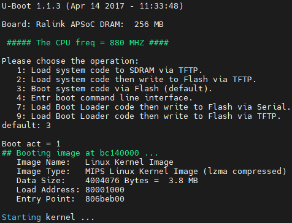
```c
0xbc140000：引导镜像flash加载的地址  
0x80001000：内核镜像解压后被加载到内存中的地址  
0x806beb00：这是内核镜像在解压后，执行的入口点地址
```
进入到U-boot
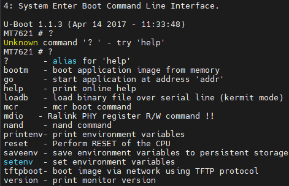
```sh
1. ?
功能: 列出可用的命令。
说明: 这是 help 命令的别名，用于获取 U-Boot 中所有可用命令的列表。
2. bootm
功能: 从内存启动应用程序镜像。
说明: 该命令用于启动已经加载到内存中的操作系统或应用程序镜像。通常用于启动 Linux 内核。
3. go
功能: 从指定地址开始执行应用程序。
说明: 该命令允许用户指定内存地址，从那里开始执行已加载的程序。这对于在内存中手动加载程序时非常有用。
4. help
功能: 打印在线帮助。
说明: 显示当前 U-Boot 中所有可用命令及其简单描述，帮助用户了解可用操作。
5. loadb
功能: 通过串口加载二进制文件（Kermit 模式）。
说明: 该命令允许用户通过串行连接使用 Kermit 协议加载二进制文件到内存。
6. mcr
功能: 执行 MCR 启动命令。
说明: 该命令通常用于特定硬件的启动操作，具体功能可能依赖于硬件实现。
7. mdio
功能: Ralink PHY 寄存器读写命令。
说明: 该命令用于访问和操作以太网 PHY 设备的寄存器，适用于网络调试。
8. nand
功能: NAND Flash 操作命令。
说明: 该命令用于读取、写入和擦除 NAND Flash 存储器，是对 NAND Flash 的直接访问。
9. printenv
功能: 打印环境变量。
说明: 显示当前 U-Boot 环境中的所有变量及其值，帮助用户查看和调试环境设置。
10. reset
功能: 重置 CPU。
说明: 该命令用于重新启动系统，通常在更改配置或遇到错误时使用。
11. saveenv
功能: 保存环境变量到持久存储。
说明: 将当前的环境变量保存到闪存，以确保下次启动时能够保留这些设置。
12. setenv
功能: 设置环境变量。
说明: 允许用户修改或添加环境变量的值，帮助配置 U-Boot 启动参数。
13. tftpboot
功能: 通过网络使用 TFTP 协议启动镜像。
说明: 该命令从 TFTP 服务器下载镜像并启动，适用于通过网络引导操作系统。
14. version
功能: 打印监视器版本。
说明: 显示当前 U-Boot 的版本信息，帮助用户确认使用的固件版本。
```
查看环境变量
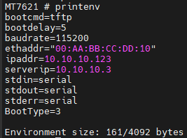
```sh
bootcmd
值: tftp
说明: 启动命令，表示系统将通过 TFTP 启动。
bootdelay
值: 5
说明: 启动延迟时间（秒）。在自动启动之前，U-Boot 会等待 5 秒，以便用户有时间按下键盘进行手动干预。
baudrate
值: 115200
说明: 串口通信速率，表示与主机通信时的波特率为 115200 bps。
ethaddr
值: "00:AA:BB:CC:DD:10"
说明: 设备的 MAC 地址，用于网络通信。
ipaddr
值: 10.10.10.123
说明: 设备的 IP 地址，在网络中标识该设备。
serverip
值: 10.10.10.3
说明: TFTP 服务器的 IP 地址，设备将从该服务器下载文件。
stdin
值: serial
说明: 标准输入源，表示通过串口接收输入。
stdout
值: serial
说明: 标准输出目标，表示通过串口输出信息。
stderr
值: serial
说明: 标准错误输出目标，表示通过串口输出错误信息。
BootType
值: 3
说明: 可能表示启动类型或模式，具体含义可能依赖于系统的自定义设置。
```
思路：通过tftpboot 将镜像加载到内存，然后通过bootm 去启动镜像，然后在新的镜像系统使用dd去提取flash
U-Boot 配置tftp服务是可以更改的，但我们这里就用默认的了
```c
setenv ipaddr 10.10.10.123      # 设备ip地址
setenv serverip 10.10.10.3      # tftp服务器的ip地址
saveenv                         # 保存环境变量
printenv                        # 打印环境变量信息
```
ubuntu搭建tftp服务
```sh
sudo apt update
sudo apt install tftpd-hpa
```
kernel下载地址：[Index of /releases/17.01.7/targets/ramips/mt7621/ (openwrt.org)](https://downloads.openwrt.org/releases/17.01.7/targets/ramips/mt7621/)
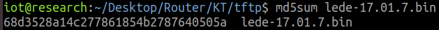
编辑配置文件，配置完成后重启服务；
```sh
sudo vim /etc/default/tftpd-hpa

TFTP_USERNAME="tftp"
TFTP_DIRECTORY="/home/iot/Desktop/Router/KT/tftp" # 这里是默认tftp文件路径,存放镜像文件路径,可自行设置
TFTP_ADDRESS="0.0.0.0:69"
TFTP_OPTIONS="--secure"

sudo systemctl restart tftpd-hpa
```
记得重启一下网卡
在uboot下执行tftpboot会显示出来加载到的地址为0x88000000
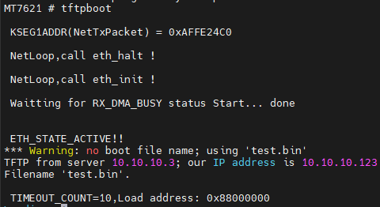
所以执行
```c
tftpboot 0x88000000 lede-17.01.7.bin
```
记得插网线
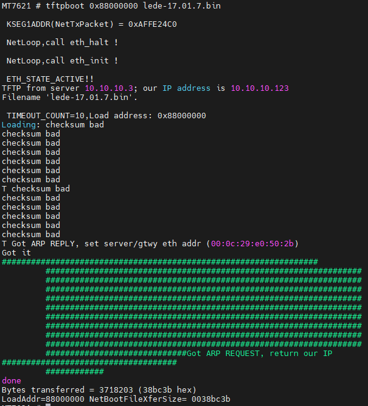
最后使用bootm命令启动镜像
```c
bootm 0x88000000
```
启动时候如果出现乱码 是因为波特率不一样，可以关闭串口终端 选择对应的波特率，重开串口终端；可以尝试一下57600，就进入到正常的shell了，这个是我们的kernel
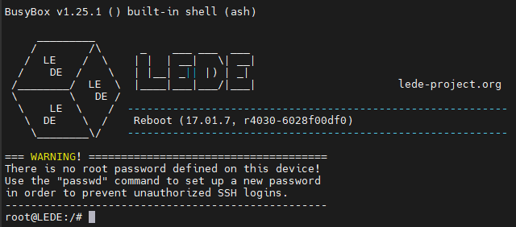
查看系统分区：
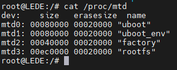
查看分区目录，mtd0 ~ mtd3为系统分区，mtd0ro ~ mtd3ro是什么分区具体没有去分析；  
这里mtdblock0 ~ mtdblock3就是flash的分区啦；
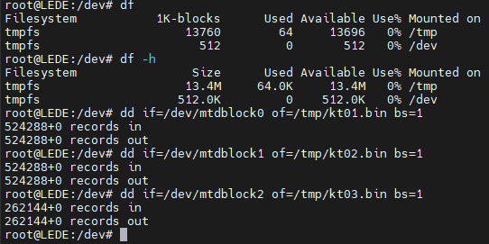
最后拷贝mtdblock3的时候系统会挂掉；df查看了下tmp空间有13M，感觉是完全足够；  
再查看前面拷贝的3个分区大小都不超过1M，后面分区应该是系统文件；尝试多次发现原来是tmp空间使用超过5M 系统就会崩溃；保险起见，最后一个按1M给它分片拷贝出来；  
(注意：这里系统挂了比较麻烦，要断电重新进入u-boot把系统拷进内存重新启动)
分片拷贝命令：

```c
dd if=/dev/mtdblock3 of=/tmp/kt04.bin bs=1M skip=0 count=1 
# 注意skip是开始提取之前跳过的块数,每次提取完记得自加一;
```
下面是拷贝和scp传ubuntu的过程，传完后删除确保tmp空间充足；
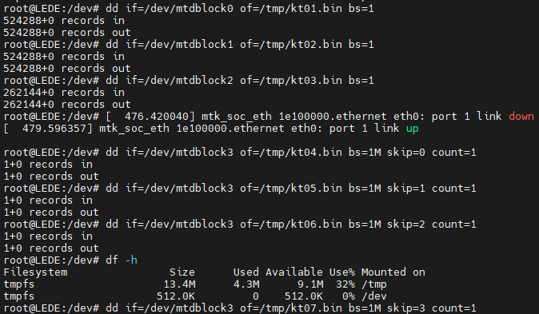
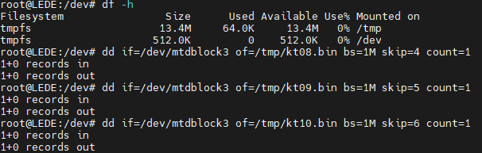
这里拷完第12个分片时候用010编辑器查看后面全是FF，由此判断数据已经拷贝完；
接下来可以用cat 将分片合并，之前还担心cat合并会有乱码，后来查了下cat合并不会破坏和改变文件原始数据，最终kt.bin合并后的文件；
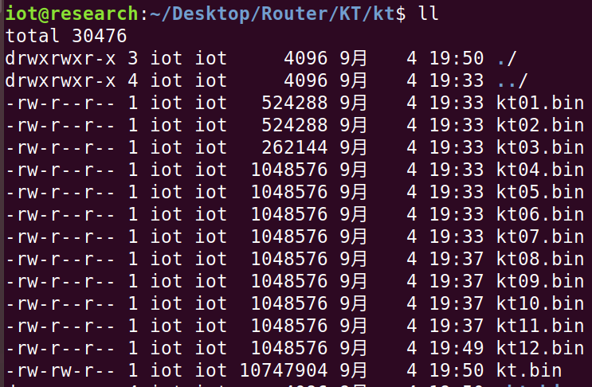
```sh
binwalk -Me kt.bin
```
解压成功
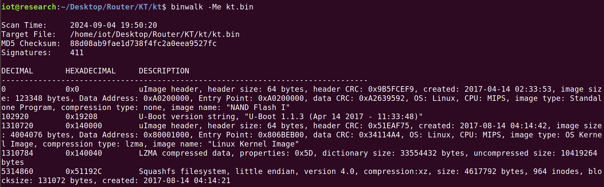
完整的文件系统
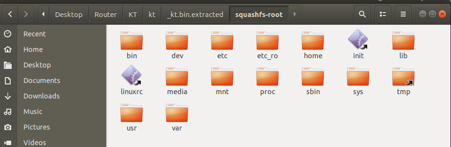