固件下载地址:[夜鹰 X8 R8300 |AC5000 智能 WIFI 路由器 |NETGEAR 支持 --- NIGHTHAWK X8 R8300 | AC5000 SMART WIFI ROUTER | NETGEAR SUPPORT](https://www.netgear.com/support/product/r8300/#download)
# 基础信息分析:
```c
binwalk -Me R8300-V1.0.2.130_1.0.99.chk
```
binwalk解压固件，发现其未加密得到完整的文件系统
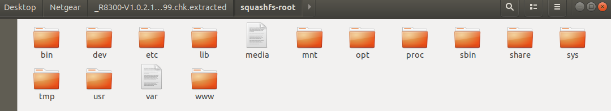
```c
sudo ./firmwalker-pro-max.sh '/home/iot/Desktop/Netgear/R8300-V1.0.2.130extracted/squashfs-root' > '/home/iot/Desktop/Netgear/R8300-V1.0.2.130extracted/firmwalker.txt'
```
firmwalker-pro-max跑一下，看看是否能获得一些有用或可疑信息
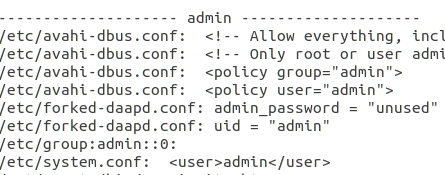
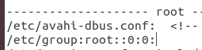
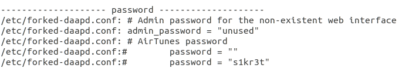
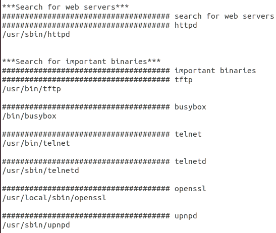
```c
file busybox
```
以最典型的busybox为例查看其为32位小端序的ARM架构
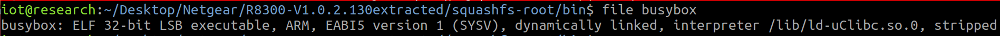
```c
checksec --file=busybox
```
发现其除了NX保护(防止在栈和堆等区域执行代码)并没有其它保护
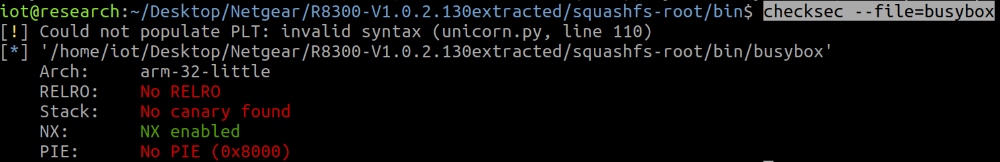
# 模拟运行固件:
这里采用qemu系统级模拟
创建虚拟网卡tap0
```c
sudo tunctl -t tap0 -u `whoami`
sudo ifconfig tap0 10.10.10.1/24 up
```
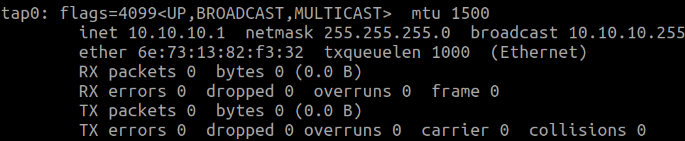
启动qemu虚拟机
```c
sudo qemu-system-arm -M vexpress-a9 -kernel vmlinuz-3.2.0-4-vexpress -initrd initrd.img-3.2.0-4-vexpress -drive if=sd,file=debian_wheezy_armhf_standard.qcow2 -append "root=/dev/mmcblk0p2 console=ttyAMA0" -net nic -net tap,ifname=tap0,script=no,downscript=no -nographic
```
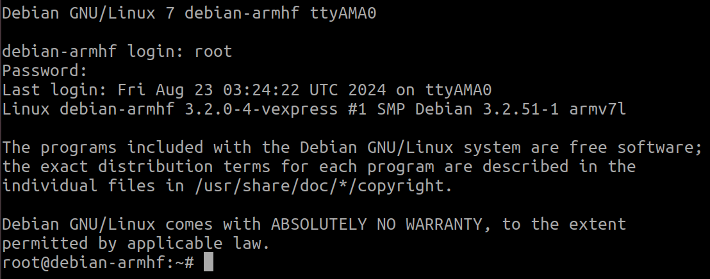
给qemu虚拟机配置虚拟网卡，让其与宿主机互通
```c
ifconfig eth0 10.10.10.2/24 up
```
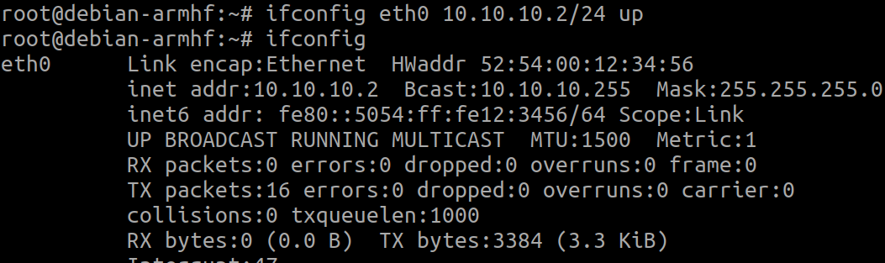
通过wget把打包好的文件系统传入到qemu虚拟机中，并在qemu虚拟机中解压出来，进入到文件系统sq目录中，开始挂载并切换根目录
```c
wget http://10.10.10.1:8000/sq.tar

tar -zxvf sq.tar

mount --bind /proc /proc 
mount --bind /dev /dev  
mount --bind /sys /sys

chroot . sh
```
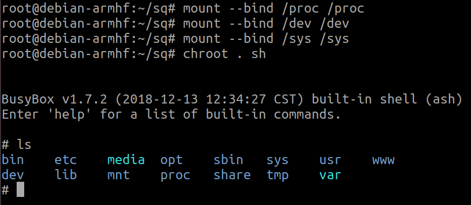
启动upnp服务发现没有报错服务也没有启动成功
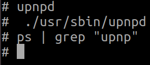
去分析一下upnpd这个二进制文件，发现需要打开一个upnpd.pid的文件，而我们这里没有，那么我们去创建一个，而var是挂载在tmp/var的
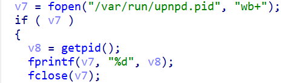
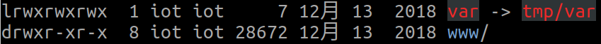
所以我们去创建一个tmp/var/run的目录
```c
mkdir -p tmp/var/run
```
再次启动upnpd，发现有报错，缺少了nvram，NVRAM( 非易失性 RAM) 用于存储路由器的配置信息，而 upnpd 运行时需要用到其中部分配置信息。
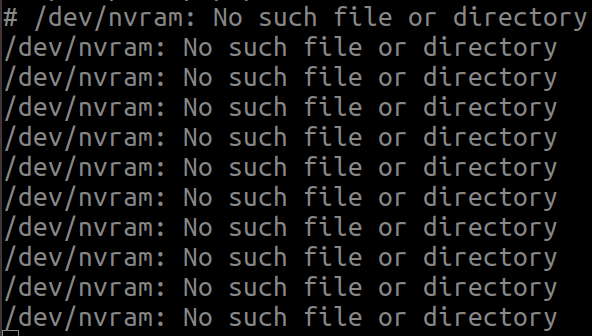
所以我们需要hook劫持其nvram的动态链接库
网上有现成的库，编译好即可:[raw.githubusercontent.com/therealsaumil/custom_nvram/master/custom_nvram_r6250.c](https://raw.githubusercontent.com/therealsaumil/custom_nvram/master/custom_nvram_r6250.c)
之前file的时候也可以看到采用的是armv5的版本，而我们虚拟机为armv7的版本固还需要用到docker来编译
操作方法:
[rootkiter/cross-cpu-compile: 嵌入式 GCC 交叉编译镜像，当前大部分编译器是基于 uclibc的。产品已经上传至 docker-hub ，可自行参考 README 的相关描述使用。 (github.com)](https://github.com/rootkiter/cross-cpu-compile)
```c
git clone https://github.com/rootkiter/cross-cpu-compile.git
cd cross-cpu-compile/
docker build -t cross-cpu-compile .
docker images
#在docker下执行
[root@container] # /root/compile_bins/cross-compiler-armv5l/bin/armv5l-gcc -Wall -fPIC -shared custom_nvram_r6250.c -o nvram2.so
```
加载nvram2.so后发现没有dlsym的符号
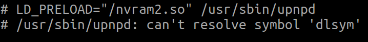
发现在libdl.so.0中有dlsym
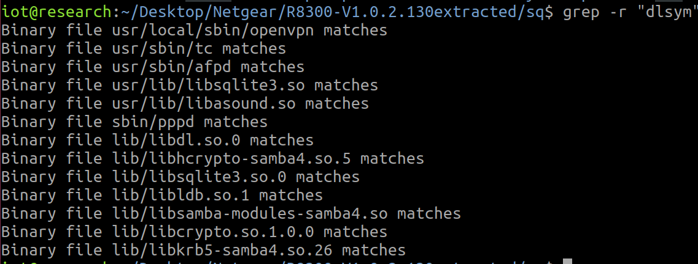
那么我们加载nvram2.so的同时也加载libdl.so.0
```c
LD_PRELOAD="/nvram2.so /libdl.so.0" /usr/sbin/upnpd
```
发现又缺少了nvram.ini文件
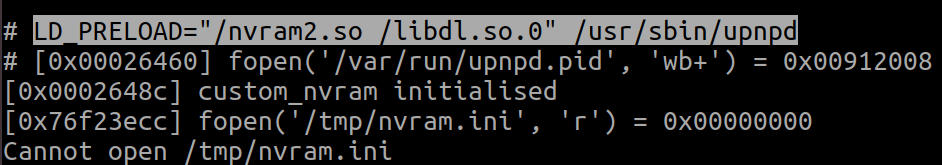
写一个nvram.ini
```c
upnpd_debug_level=9
lan_ipaddr=10.10.10.1
hwver=R8500
friendly_name=R8300
upnp_enable=1
upnp_turn_on=1
upnp_advert_period=30
upnp_advert_ttl=4
upnp_portmap_entry=1
upnp_duration=3600
upnp_DHCPServerConfigurable=1
wps_is_upnp=0
upnp_sa_uuid=00000000000000000000
lan_hwaddr=AA:BB:CC:DD:EE:FF
```
upnp服务启动成功