记录一次打印机漏洞研究的过程
# 打印机语言
一些常见的打印机语言:
1.PostScript
一种页面描述语言，用于高质量图形和文本打印。
2.PCL (Printer Command Language)
惠普开发的打印机语言，广泛用于激光打印机。
3.ESC/P (Epson Standard Code for Printers)
Epson 打印机使用的命令语言，主要用于点阵打印机。
4.PDF (Portable Document Format)
虽然不是专门的打印机语言，但许多打印机可以直接处理 PDF 文件。
5.ZPL (Zebra Programming Language)
主要用于条形码和标签打印机。
6.GDI (Graphics Device Interface)
微软的图形设备接口，常用于 Windows 打印。
7.Raster Graphics
将图像作为像素数据发送到打印机，常用于图像打印。
8.PJL (Printer Job Language)
用于控制打印作业和打印机状态信息。
# 安全性及漏洞点
此次用到的工具只支持ps,pjl,pcl这三种，故详细介绍一下这三种类型的语言
1.PostScript 由于其可编程性，恶意用户可以插入恶意代码。
可以造成以下漏洞:
代码执行：攻击者可以通过发送包含恶意 PostScript 代码的文件，利用打印机的解析能力执行任意代码。
信息泄露：如果打印机支持网络，恶意代码可以通过网络发送敏感数据。
2.PJL 用于控制打印机状态和作业，允许用户发送控制命令。由于缺乏身份验证，任何能够访问打印机的用户都可以发送 PJL 命令。
可以造成以下漏洞:
权限提升：攻击者可以利用 PJL 命令获取打印机的管理权限，改变配置或监控打印作业。
拒绝服务攻击：通过发送大量无效命令，攻击者可以导致打印机崩溃或停止工作。
3.PCL 的命令集相对简单，但同样可以被滥用。
可以造成以下漏洞:
命令注入：攻击者可以通过精心构造的 PCL 文件注入恶意命令，操纵打印机的行为。
信息泄露：通过特定的 PCL 命令，攻击者可能获取打印机的状态和配置信息。
# 漏洞研究过程
公司有一台EPSON L4158打印机，其有WiFi功能可以连接到与我主机同一网段下
我们可以查看到自己的ip是在2段上，但又不知道打印机设备的ip是什么
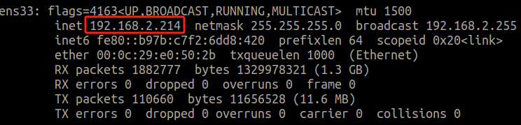
使用nmap扫描整个 192.168.2.0 网段
```sh
sudo nmap -sS -sV -O 192.168.2.0/24
```
-sS：使用 TCP SYN 扫描，快速且隐蔽。
-sV：检测服务版本，获取更多关于开放端口的信息。
-O： 操作系统检测，尝试识别目标主机的操作系统。
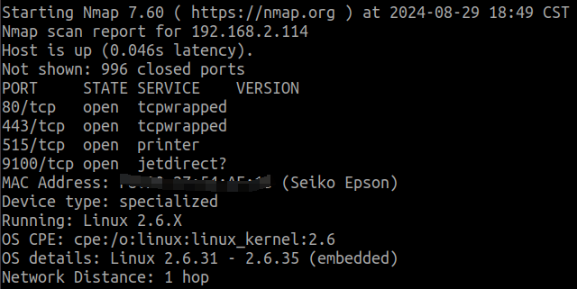
515端口 用于传统的 LPD 打印服务，适合需要排队管理的打印任务
9100端口 用于快速、直接的打印服务，广泛支持现代打印机
使用到的工具就是利用9100端口来进行渗透
# PRET
由于EPSON L4158型号是不支持这三种语言的，所以我们用工具渗透的时候只会把源码给打印出来
执行打印命令后，打印成功则会回显H
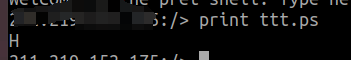
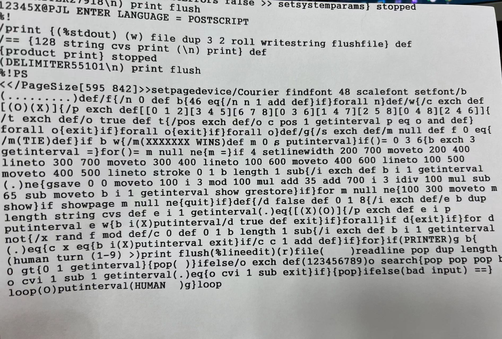
在zoomeye中搜索`port:9100 pjl`获取到一个ip
在github上搜索到PRET工具，git下来，进入到这个目录
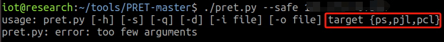
```sh
python pret --safe ip ps/pjl/pcl
```
--safe 在连接前尝试通过 IPP、HTTP 和 SNMP 检查设备是否实际支持所选的打印语言 （PS/PJL/PCL），若成功语言支持则直接就连接成功了
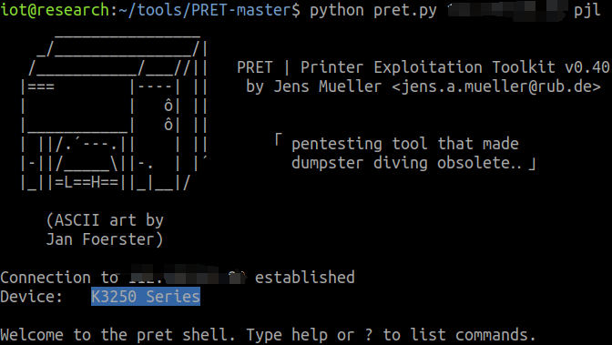
可以看到设备为K3250
help或？可以查看在ps/pjl/pcl中可以执行的命令
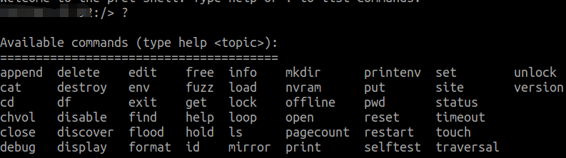
查看其基础信息
```sh
info status
info memory
version
```
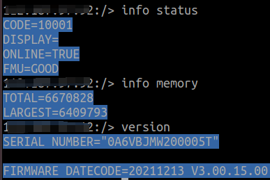
# 漏洞利用
利用print命令可以打印我们本地写的一个井字棋的ps脚本，让其打印机识别且执行打印出来一个井字棋盘，返回H则证明我们执行成功了

利用traversal命令可以实现目录穿越，经过验证../../不能够实现但是../.../就可以实现目录穿越了
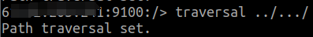
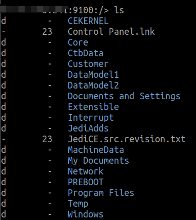
ls查看到我们要穿越的目录，就可以再结合get命令，达到下载到我们本机中

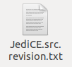
在实际渗透中，如果打印机设置了保存其打印过的作业在打印机中，那么我们就可以通过PRET这个工具，结合命令操作，目录穿越到想要下载内容的目录中，获取到我们想要的文件内容信息
# 三种语言模式下的命令
PS 模式下的命令
```sh
# 设备和状态信息
id：显示设备的基本信息，包括型号和状态。
version：显示 PostScript 解释器的版本。
devices：列出可用的输入/输出设备。
uptime：显示系统的运行时间，可能是随机的。
date：显示打印机的系统日期和时间。
pagecount：显示打印机的页面计数器，反映已打印的总页数。
# 控制和配置命令
lock：设置启动作业和系统参数的密码。
unlock：取消设置启动作业和系统参数的密码。
restart：重启 PostScript 解释器。
reset：将 PostScript 设置重置为工厂默认值。
disable：禁用打印功能。
destroy：导致打印机的 NVRAM 物理损坏（非常危险的命令）。
hang：执行 PostScript 无限循环，导致打印机无响应。
# 打印操作和处理
overlay <file.eps>：在所有打印输出上叠加指定的 EPS 文件。
cross <font> <text>：在所有打印输出上添加指定的字体和文本（类似于水印）。
replace <old> <new>：在将要打印的文档中替换字符串。
capture：捕获进一步的打印作业。
hold：启用作业保留功能，暂时保留打印作业。
# 字典和资源管理
set <key=value>：在最上层字典中设置键值对。
known <operator>：列出支持的 PostScript 操作符。
search <key>：在所有字典中按键搜索。
dicts：返回字典及其权限的列表。
resource <category> [dump]：列出或转储指定类别的 PostScript 资源。
# 字典操作
dump <dict>：转储指定字典的内容。
可用字典包括：
systemdict：系统级字典。
statusdict：状态字典。
userdict：用户字典。
globaldict：全局字典。
serverdict：服务器字典。
errordict：错误字典。
internaldict：内部字典。
currentsystemparams：当前系统参数字典。
currentuserparams：当前用户参数字典。
currentpagedevice：当前页面设备字典。
# 配置命令
config <setting>：更改打印机设置，包括：
duplex：设置双面打印。
copies #：设置打印的副本数量。
economode：设置经济模式。
negative：设置负片打印。
mirror：设置镜像翻转。
```
PJL 模式下的命令
```sh
# 设备信息和状态
id：显示设备信息，包括型号等。
status：启用状态消息，打印机将报告其状态。
version：显示固件版本或序列号（来源于 info config）。
pagecount <number>：操作打印机的页面计数器，可以设置或查询当前计数。
printenv <VAR>：显示指定的打印机环境变量。
env：显示环境变量（与 info variables 相同）。
# 环境变量管理
set <VAR=VALUE>：设置打印机环境变量。
# 控制和配置命令
display <message>：设置打印机显示的消息。
offline <message>：将打印机置于离线状态，并显示指定消息。
restart：重启打印机。
reset：将打印机重置为出厂默认设置。
selftest：执行各种打印机自检。
disable：禁用打印功能。
destroy：导致打印机的 NVRAM 物理损坏（非常危险）。
flood：洪水攻击用户输入，可能泄露缓冲区溢出信息。
# 锁定与解锁
lock：锁定控制面板设置和磁盘写入访问权限。
unlock：解锁控制面板设置和磁盘写入访问权限。
hold：启用作业保留功能，暂时保留打印作业。
# NVRAM 操作
nvram <operation>：执行 NVRAM 操作：
nvram dump [all]：转储（所有）NVRAM 到本地文件。
nvram read addr：从指定地址读取单个字节。
nvram write addr value：向指定地址写入单个字节。
# 信息显示
info <category>：显示信息：
info config：提供配置相关信息。
info filesys：返回 PJL 文件系统信息。
info id：提供打印机型号。
info memory：识别可用内存量。
info pagecount：返回已打印的页面数量。
info status：提供当前打印机状态。
info ustatus：列出未请求的状态变量。
info variables：列出打印机的环境变量。
```
PCL 模式下的命令
```sh
# 自检和信息显示
selftest：执行打印机自检，测试打印机的基本功能，确保其正常工作。
# 信息查询
info <category>：显示信息，具体类别包括：
info fonts：显示已安装的字体列表。
info macros：显示已安装的宏（可重用的命令序列）。
info patterns：显示用户定义的图案。
info symbols：显示符号集。
info extended：显示扩展字体信息，通常包括额外的字体样式和变体。
```
# ttt.ps
```ps
%!PS
<</PageSize[595 842]>>setpagedevice/Courier findfont 48 scalefont setfont/b
(.........)def/f{/n 0 def b{46 eq{/n n 1 add def}if}forall n}def/w{/c exch def
[(O)(X)]{/p exch def[[0 1 2][3 4 5][6 7 8][0 3 6][1 4 7][2 5 8][0 4 8][2 4 6]]{
/t exch def/o true def t{/pos exch def/o c pos 1 getinterval p eq o and def}
forall o{exit}if}forall o{exit}if}forall o}def/g{/s exch def/m null def f 0 eq{
/m(TIE)def}if b w{/m(XXXXXXX WINS)def m 0 s putinterval}if()= 0 3 6{b exch 3
getinterval =}for()= m null ne{m =}if 4 setlinewidth 200 700 moveto 200 400
lineto 300 700 moveto 300 400 lineto 100 600 moveto 400 600 lineto 100 500
moveto 400 500 lineto stroke 0 1 b length 1 sub{/i exch def b i 1 getinterval
(.)ne{gsave 0 0 moveto 100 i 3 mod 100 mul add 35 add 700 i 3 idiv 100 mul sub
65 sub moveto b i 1 getinterval show grestore}if}for m null ne{100 300 moveto m
show}if showpage m null ne{quit}if}def{/d false def 0 1 8{/i exch def/e b dup
length string cvs def e i 1 getinterval(.)eq{[(X)(O)]{/p exch def e i p
putinterval e w{b i(X)putinterval/d true def exit}if}forall}if d{exit}if}for d
not{/x rand f mod def/c 0 def 0 1 b length 1 sub{/i exch def b i 1 getinterval
(.)eq{c x eq{b i(X)putinterval exit}if/c c 1 add def}if}for}if(PRINTER)g b{
(human turn (1-9) >)print flush(%lineedit)(r)file(    )readline pop dup length
0 gt{0 1 getinterval}{pop( )}ifelse/o exch def(123456789)o search{pop pop pop b
o cvi 1 sub 1 getinterval(.)eq{o cvi 1 sub exit}if}{pop}ifelse(bad input) ==}
loop(O)putinterval(HUMAN  )g}loop
```