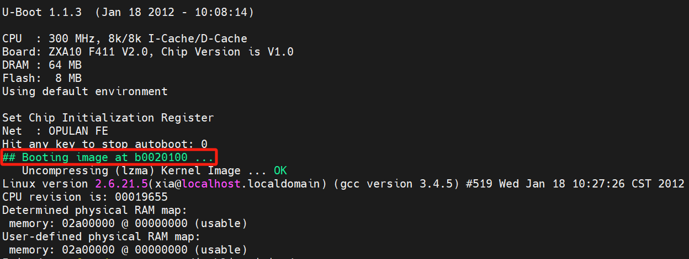
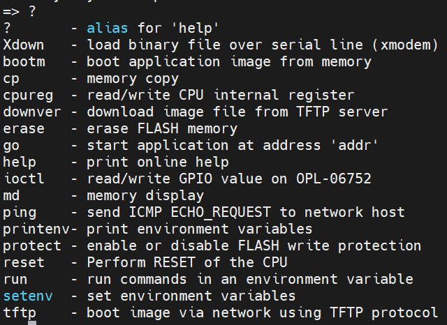
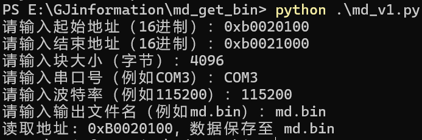
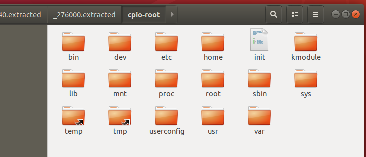
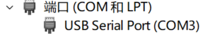

# 信息收集:



Booting image at b0020100 ... 的意思是系统正在从内存地址 0xb0020100 启动一个镜像（通常是操作系统或内核映像）。这个过程通常发生在设备启动时，内核或引导加载程序会加载并执行位于该内存地址的代码，以开始系统的初始化和启动过程。
```c
RAMDISK driver initialized: 16 RAM disks of 4096K size 1024 blocksize
```
这一行描述了 RAMDISK（内存磁盘）驱动程序的初始化。RAMDISK 是一种将系统内存的一部分模拟成磁盘的技术，常用于嵌入式系统或需要高速 I/O 的场合。
- **`16 RAM disks`**：表示系统中初始化了 16 个 RAM 磁盘。每个磁盘是一个独立的逻辑设备，可以像普通磁盘一样使用。
- **`4096K size`**：每个 RAM 磁盘的大小为 4096 KB，即 4 MB。这意味着 16 个 RAM 磁盘的总内存占用为 64 MB。
- **`1024 blocksize`**：表示 RAMDISK 的块大小为 1024 字节（1 KB）。块大小是文件系统的基本单位，影响数据存储的效率和性能。
```c
Creating 7 MTD partitions on "NOR Flash":
0x00000000-0x00800000 : "whole flash"
0x00000000-0x00020000 : "bootloader"
0x007f0000-0x00800000 : "env"
0x00020000-0x003d0000 : "kernel_ramfs0"
0x00780000-0x007e0000 : "userconfig"
0x007e0000-0x007f0000 : "parameter tags"
0x003d0000-0x00780000 : "kernel_ramfs1"
nf_conntrack version 0.5.0 (336 buckets, 2688 max)
```
- **MTD 分区创建**：系统在 8 MB 的 NOR 闪存上创建了 7 个分区，每个分区都有特定的用途，如存储引导加载程序、内核、文件系统、用户配置和环境变量。这种分区方案常用于嵌入式系统中，以合理管理有限的存储空间。

md命令通常用于读取内存中的数据



md命令的存在是用脚本提取的前提，再一个大前提uboot得能进得去先，有密码就得另说，二开吧兄弟们
# 执行效果:
## eg:



执行读取完成后生成的md.bin直接用binwalk解压即可



## ps:
**起始地址信息**:Booting image at b0020100
**结束地址信息**:具体情况具体分析了，我们这里提这个固件是0xb0020100到0xb0820100
**块大小**:经过测试超过4096固件就会重启导致读取失败，也许其余固件可以读大一些，但最好是读1024的倍数
**串口号**:在设备管理器可以找到
**波特率**:一般为115200，这个可以在连串口的时候测试的到，波特率不对就会乱码
# python:
```python
import serial
import time
import re

def dump_memory_test(start_address, end_address, chunk_size, serial_port, baud_rate, output_file):

    with serial.Serial(serial_port, baud_rate, timeout=2) as ser:

        with open(output_file, 'wb') as f:

            current_address = start_address

            while current_address < end_address:

                command = f"md {current_address:X} {chunk_size // 4:X}\n".encode('utf-8')

                ser.write(command)

                time.sleep(0.1)


                raw_output = b''

                while True:

                    line = ser.readline().decode('utf-8').strip()

                    if line == '':

                        break

                    match = re.search(r'^[0-9a-fA-F]{8}: ([0-9a-fA-F]{8} [0-9a-fA-F]{8} [0-9a-fA-F]{8} [0-9a-fA-F]{8})', line)

                    if match:

                        hex_data = match.group(1).replace(' ', '')

                        raw_output += bytes.fromhex(hex_data)

                if raw_output:

                    f.write(raw_output)

                    print(f"读取地址: 0x{current_address:X}, 数据保存至 {output_file}")

                current_address += chunk_size 

if __name__ == '__main__':

    start_address = int(input("请输入起始地址（16进制）："), 16)
    end_address = int(input("请输入结束地址（16进制）："), 16)
    chunk_size = int(input("请输入块大小（字节）："))
    serial_port = input("请输入串口号（例如COM3）：")
    baud_rate = int(input("请输入波特率（例如115200）："))
    output_file = input("请输入输出文件名（例如md.bin）：")

    dump_memory_test(start_address, end_address, chunk_size, serial_port, baud_rate, output_file)
```
# Tips:
启动过程涉及多个步骤，以下是路由器在插电后从 U-Boot 启动闪存到内存的详细过程：
## 1.上电自检
- **上电**: 路由器插上电源后，电源管理芯片开始工作。
- **自检**: 硬件进行初步的自检，确保 CPU、内存和其他关键组件正常。
## 2.初始化 U-Boot
- **U-Boot 代码执行**: ==CPU 从预定义的启动地址（通常是闪存中的某个位置）加载 U-Boot 的第一部分代码==。
- **初始化硬件**: U-Boot 会初始化必要的硬件组件，包括时钟、内存控制器和串口等。
## 3.加载环境变量
- **读取环境变量**: U-Boot 从闪存中读取环境变量，这些变量定义了启动参数和网络设置。
- **设置启动选项**: 根据环境变量，U-Boot 确定要加载的内核映像和根文件系统的位置。
## 4.加载内核
- **查找内核映像**: U-Boot 根据环境变量中的路径，从闪存中查找内核映像（通常是压缩的 Linux 内核）。
- **将内核加载到内存**: ==U-Boot 将内核映像从闪存复制到 RAM 中的预定位置==。
## 5.解压缩内核
- **解压缩内核**: 如果内核是压缩的，U-Boot 会在内存中解压缩它，以便 CPU 可以执行。
## 6.启动内核
- **设置启动参数**: U-Boot 设置内核启动参数，包括内存地址、设备树（Device Tree）等。
- **跳转到内核入口**: U-Boot 将控制权转交给内核，通常是通过==跳转到内核的入口地址==。
## 7.内核初始化
- **内核启动**: Linux 内核开始执行，初始化系统资源、驱动程序和其他关键组件。
- **挂载根文件系统**: 内核会挂载根文件系统，以便访问文件和程序。
## 8.完成启动
- **启动用户空间**: 内核启动完毕后，开始运行初始进程（通常是 `init` 或 `systemd`），进入用户空间。
- **提供网络服务**: 路由器根据配置启动网络服务，准备处理网络请求。
## 总结
整个过程从上电到启动内核涉及硬件自检、加载 U-Boot、读取环境变量、加载和解压缩内核、以及内核的初始化和启动。每个步骤都是确保系统能够正常工作的重要环节。

需要注意的是，在我们进入到uboot的时候时，文件系统还没加载到内存上，在 U-Boot 模式下，读取的内存地址 b0020100 及其后续内容确实可能包含内核和文件系统的映像，但这并不意味着文件系统已经被加载，实际上是在查看内存中存储的原始数据。

闪存中的内容主要是系统引导和运行所需的固件、内核、文件系统及配置数据，确保设备能够正常启动和工作。内存中的原始数据主要包括内核映像、文件系统映像和相关的配置数据，这些都是系统启动和运行所必需的。
