# 安装测试
安装必须的软件包（22.04）
```sh
sudo apt-get install curl gnupg2 wget git apt-transport-https ca-certificates -y
```
默认情况下，Mosquitto 软件包在 Ubuntu 22.04 默认存储库中不可用。因此，需要将 Mosquitto 的官方存储库添加到 APT
```sh
sudo add-apt-repository ppa:mosquitto-dev/mosquitto-ppa -y
```
添加好后，安装mosquitto服务器（18）
```sh
sudo apt-get install mosquitto mosquitto-clients -y
```
验证mosquitto状态
```sh
sudo systemctl status mosquitto.service
```

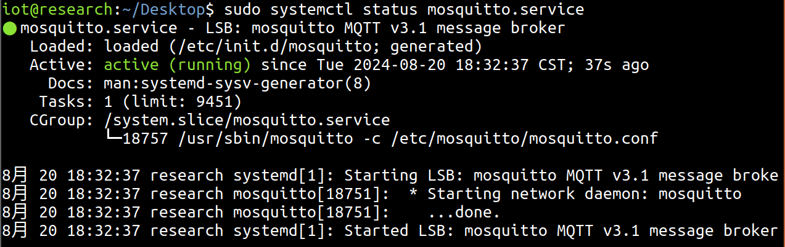

创建MQTT管理密码，设置管理员用户和密码
```sh
sudo mosquitto_passwd -c /etc/mosquitto/passwd wyb
#设置密码为WYBwyb
-c 创建
```
编辑MQTT配置文件并定义端口和密码文件
```sh
sudo vim /etc/mosquitto/mosquitto.conf
#写入
password_file /etc/mosquitto/passwd
```

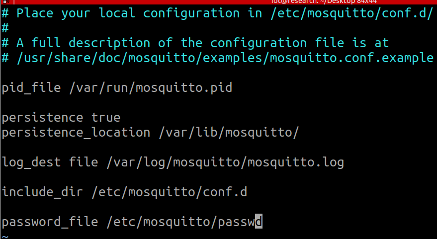

重启mosquitto服务应用我们的更改信息
```sh
sudo systemctl restart mosquitto
```
订阅 **home/lights/kids_bedroom** 主题
```sh
mosquitto_sub -u wyb -P WYBwyb -t "home/lights/kids_bedroom"
-u 用户名
-P 密码
-t 主题
```
打开新的终端界面，向 **home/lights/kids_bedroom** 主题发布消息
```sh
mosquitto_pub -u wyb -P WYBwyb -m "ON" -t "home/lights/kids_bedroom"
mosquitto_pub -u wyb -P WYBwyb -m "OFF" -t "home/lights/kids_bedroom"
-m 发布信息
```
在开启服务的终端会显示所发送的消息

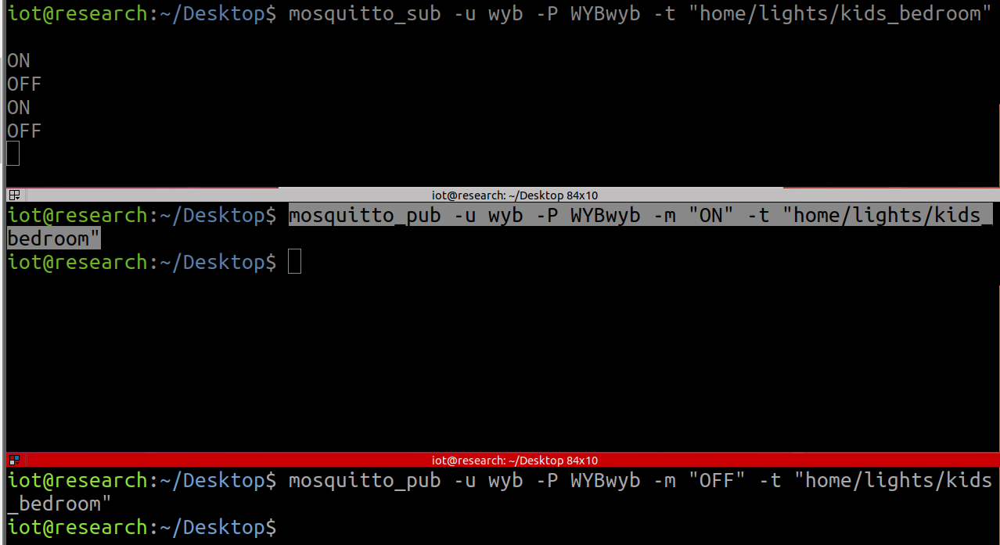

canda python环境
```sh
#开启canda mqtt-pwn
conda activate mqtt-pwn
#关闭canda
conda deactivate
```
暴力破解攻击，先把匿名访问设置为false，是指必须要账户和密码

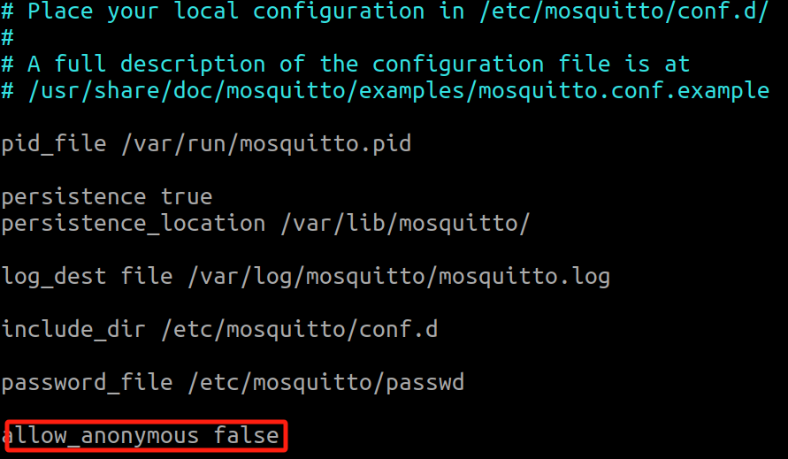

为true的话就可以直接连接
```sh
connect -o 127.0.0.1
-o ip
```

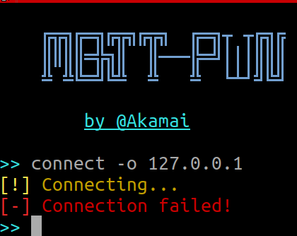

```sh
bruteforce --host 127.0.0.1 --port 1883
--host ip
--port 端口
```
得到账户名为wyb密码为WYBwyb

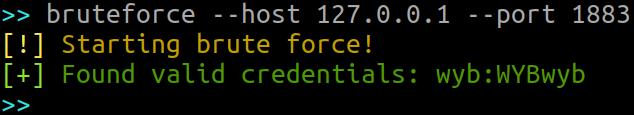

用账户名和密码连接
```sh
connect -o 127.0.0.1 -u wyb -w WYBwyb
```
查看当前状态system_info

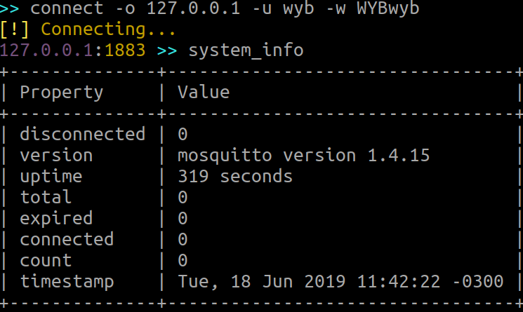

disconnected：已断开的连接数量。
version：当前运行的 MQTT 代理版本。
uptime：代理自启动以来的运行时间。
total：当前连接到代理的客户端数。
expired：已过期的连接数量。
connected：当前连接到代理的客户端数量。
count：当前订阅的主题数量。
maximum：代理允许的最大客户端连接数。

用discovery的时候会出现错误信息，其提示为找不到definitions.json这个文件
但其实文件是有的，去看那里调用设置了这个文件，发现在passive_parser.py这个文件中给的路径不对，于是我们写成绝对路径来访问它

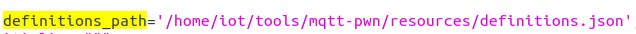

这样子discovery命令就会顺利执行
scans 命令用于显示当前进行的或已完成的扫描任务的状态。这些扫描通常用于发现 MQTT 主题或其他相关信息。

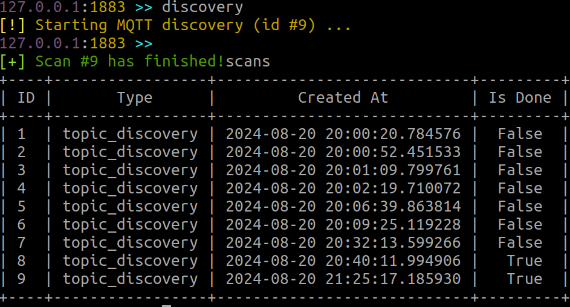

scans -i 9 命令的意思是查看或获取 ID 为 9 的扫描任务的详细信息。

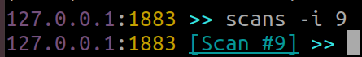

topics 主题列表

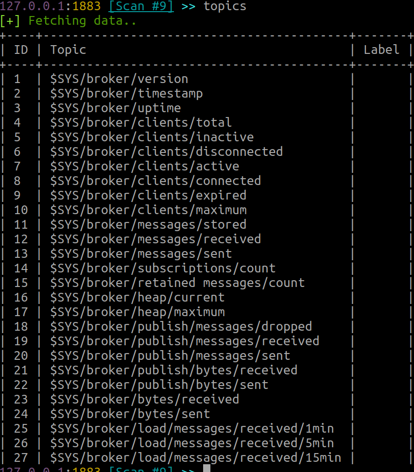


| ID  | Topic                                      | 说明                |
| --- | ------------------------------------------ | ----------------- |
| 1   | `$SYS/broker/version`                      | 代理的版本信息           |
| 2   | `$SYS/broker/timestamp`                    | 代理的当前时间戳          |
| 3   | `$SYS/broker/uptime`                       | 代理的运行时间           |
| 4   | `$SYS/broker/clients/total`                | 连接的总客户端数量         |
| 5   | `$SYS/broker/clients/inactive`             | 当前未激活的客户端数量       |
| 6   | `$SYS/broker/clients/disconnected`         | 已断开的客户端数量         |
| 7   | `$SYS/broker/clients/active`               | 当前活跃的客户端数量        |
| 8   | `$SYS/broker/clients/connected`            | 当前连接的客户端数量        |
| 9   | `$SYS/broker/clients/expired`              | 已过期的客户端数量         |
| 10  | `$SYS/broker/clients/maximum`              | 允许的最大客户端连接数       |
| 11  | `$SYS/broker/messages/stored`              | 存储的消息数量           |
| 12  | `$SYS/broker/messages/received`            | 接收到的消息数量          |
| 13  | `$SYS/broker/messages/sent`                | 发送的消息数量           |
| 14  | `$SYS/broker/subscriptions/count`          | 当前的订阅数量           |
| 15  | `$SYS/broker/retained messages/count`      | 保留的消息数量           |
| 16  | `$SYS/broker/heap/current`                 | 当前堆内存使用量          |
| 17  | `$SYS/broker/heap/maximum`                 | 最大堆内存使用量          |
| 18  | `$SYS/broker/publish/messages/dropped`     | 丢弃的发布消息数量         |
| 19  | `$SYS/broker/publish/messages/received`    | 接收到的发布消息数量        |
| 20  | `$SYS/broker/publish/messages/sent`        | 发送的发布消息数量         |
| 21  | `$SYS/broker/publish/bytes/received`       | 接收到的字节总数          |
| 22  | `$SYS/broker/publish/bytes/sent`           | 发送的字节总数           |
| 23  | `$SYS/broker/bytes/received`               | 接收到的总字节数          |
| 24  | `$SYS/broker/bytes/sent`                   | 发送的总字节数           |
| 25  | `$SYS/broker/load/messages/received/1min`  | 最近 1 分钟内接收到的消息数量  |
| 26  | `$SYS/broker/load/messages/received/5min`  | 最近 5 分钟内接收到的消息数量  |
| 27  | `$SYS/broker/load/messages/received/15min` | 最近 15 分钟内接收到的消息数量 |
|     |                                            |                   |
messages展示信息内容

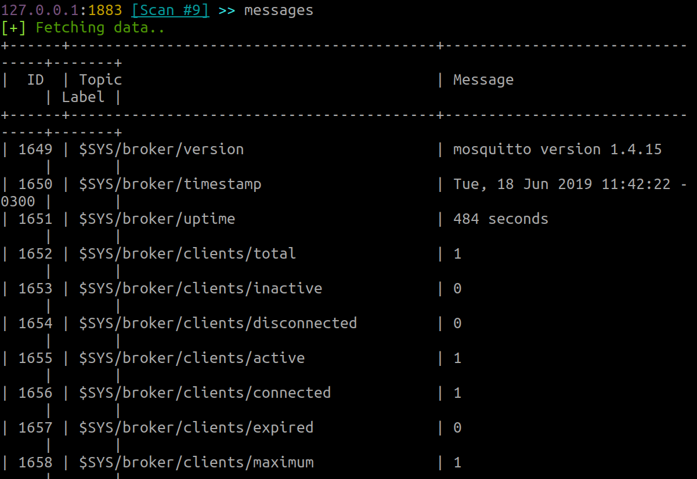

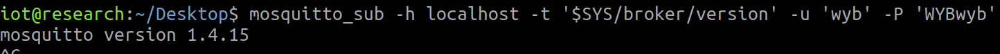


# 实战应用
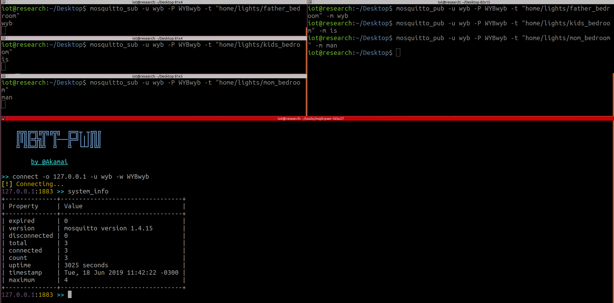

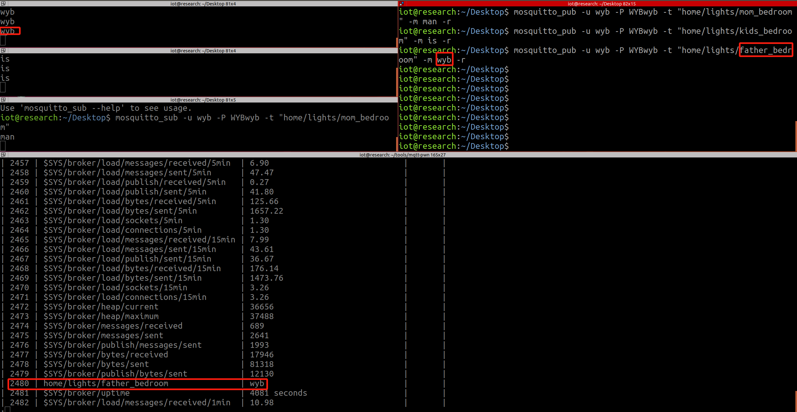

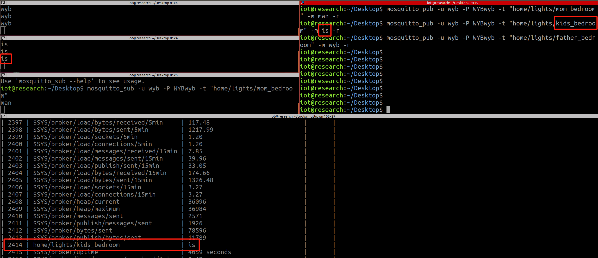

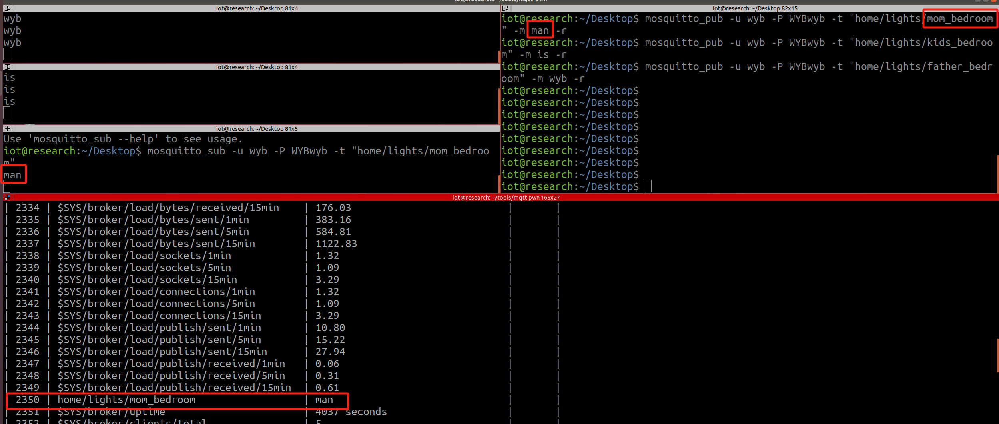


nmap扫描2端在线的ip
```sh
nmap -sn 192.168.2.0/24
```

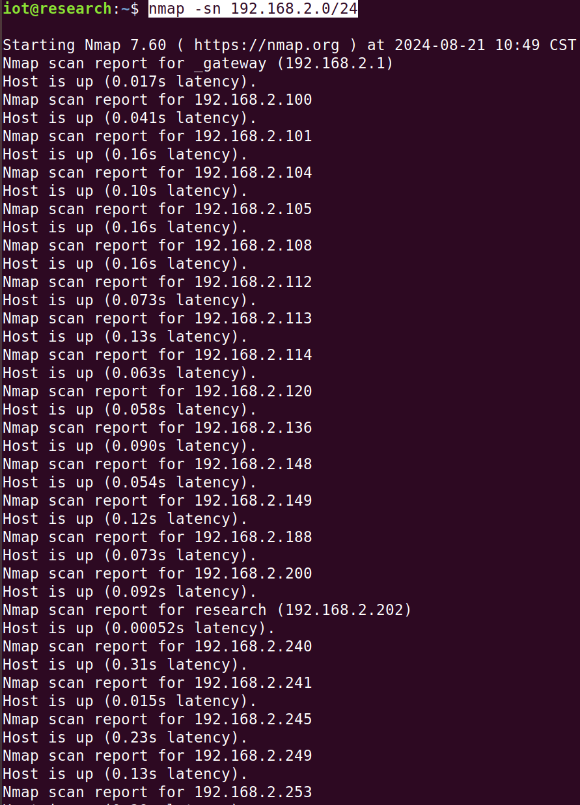

扫了其1000-2000端口，发现其1883端口开启

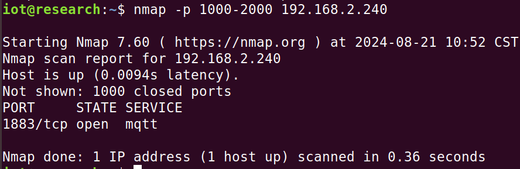

连接至

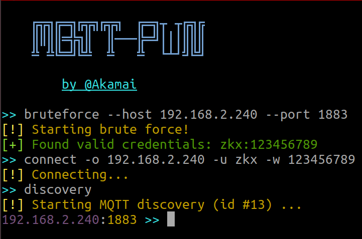

message发现主题与信息

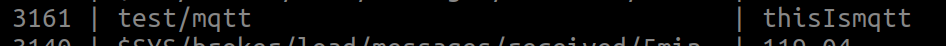

在外面连接
```sh
mosquitto_sub -u zkx -P 123456789 -t "test/mqtt" -h 192.168.2.240
```

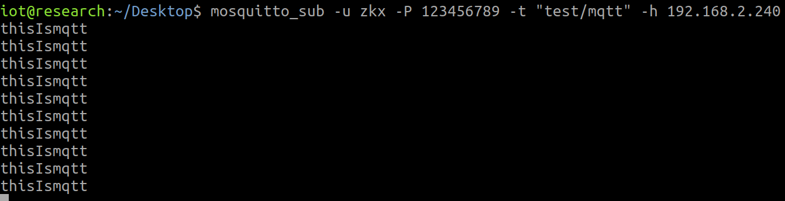
