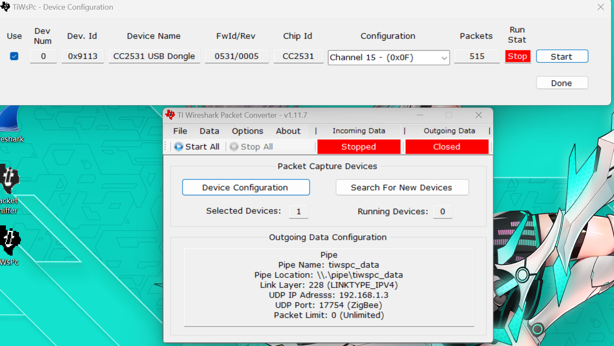
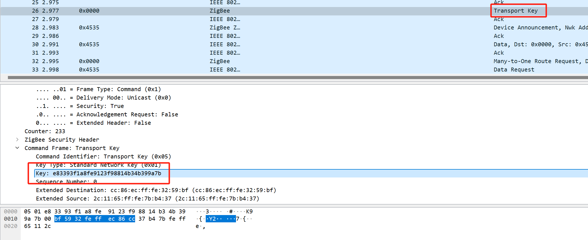
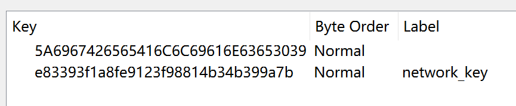
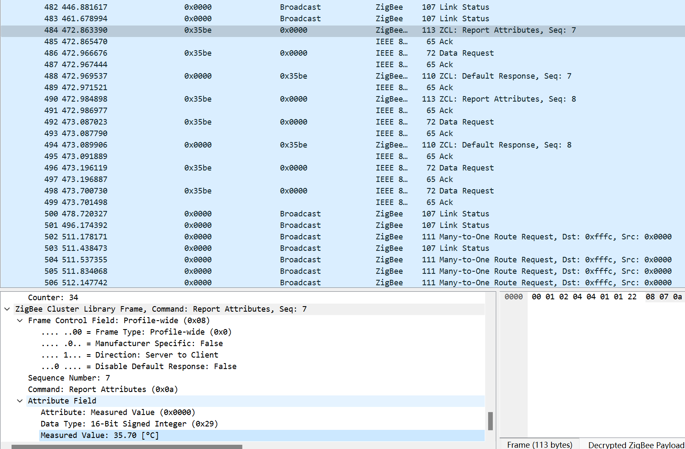

选择channel信道，start开始嗅探

而网络密钥要再每次设设备与网关重新配对的时候才会发送一个网络密码，通过抓包可以获取
说直白些就是连过一次了就不会再发了，要第一次连

wireshrk中编辑->首选项->protocols->edit->添加key
5A6967426565416C6C69616E63653039为链接密钥都是默认的
后者为每个设备的网络密钥

放好密钥后，就会明文显示
